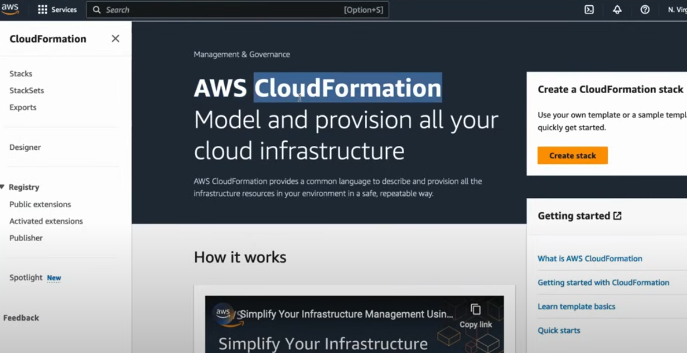
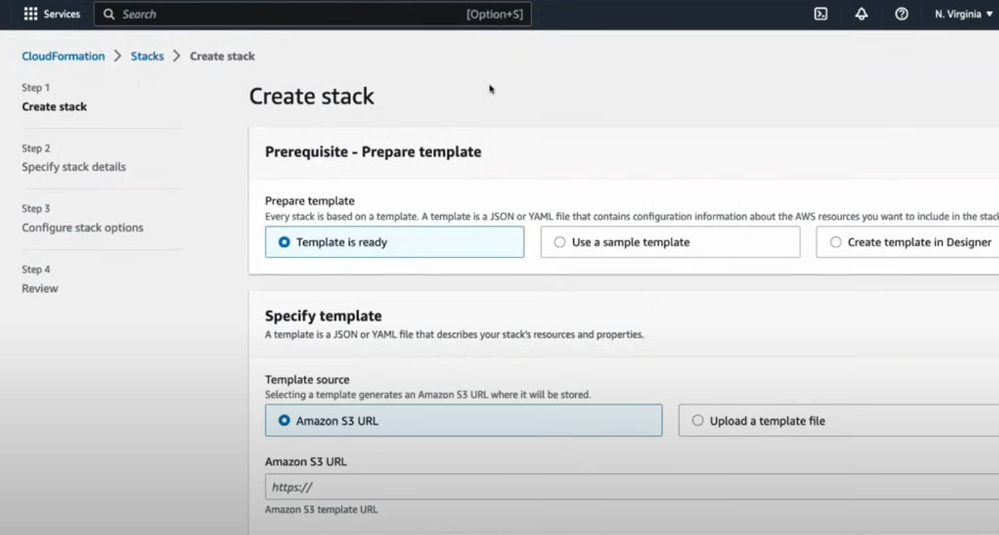
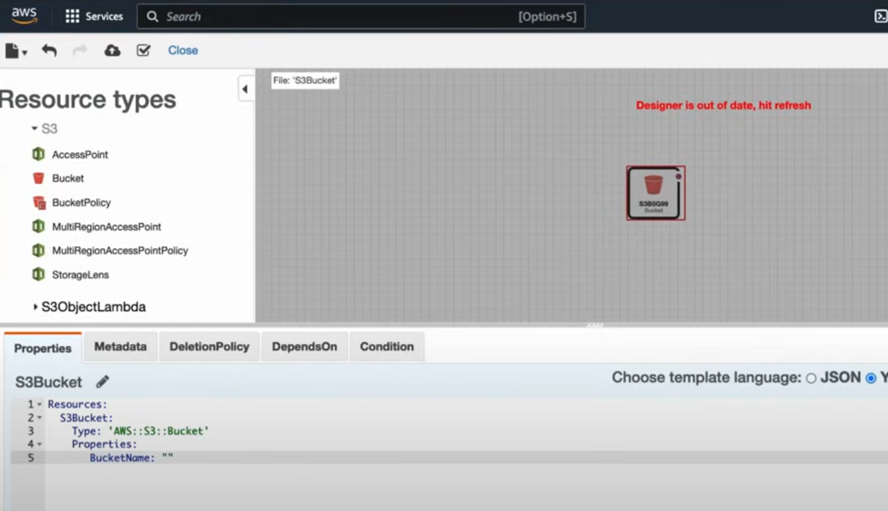
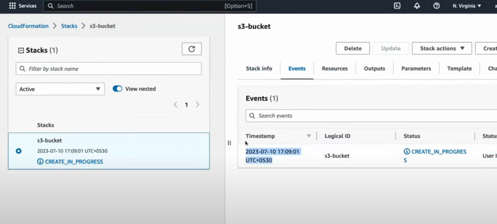
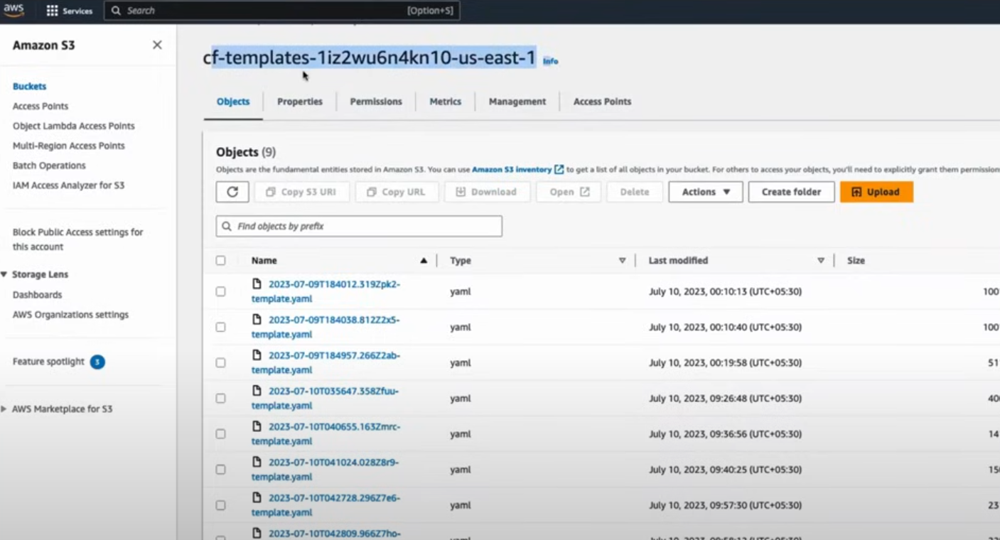
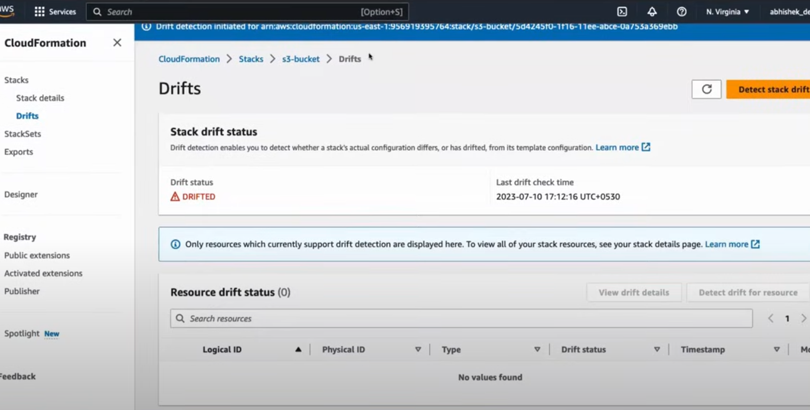
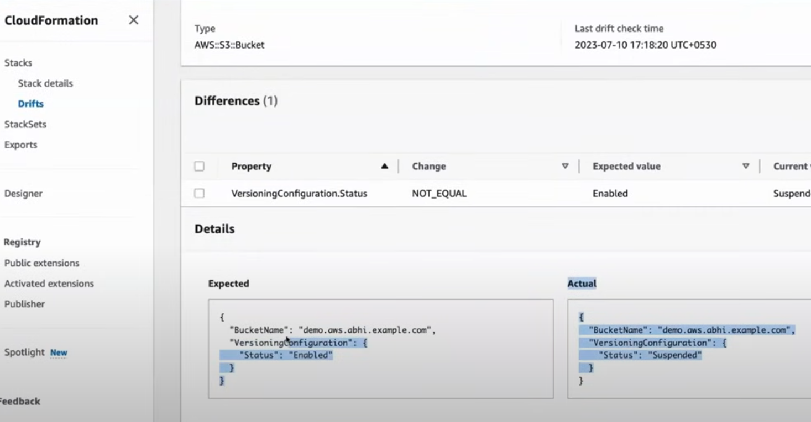
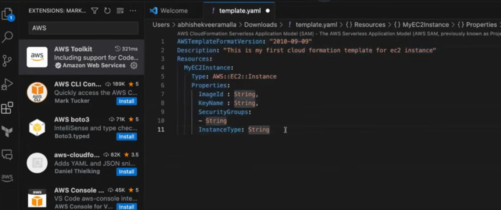

# AWS Cloud Formation Templates

**AWS CloudFormation and Terraform are both Infrastructure-as-Code (IaC) tools that help automate and manage cloud infrastructure, but they have some key differences in how they work and their scope.**


---
### 1. AWS CloudFormation:
- **AWS-specific: CloudFormation is an AWS-native tool used to define, provision, and manage AWS resources like EC2, S3, RDS, and more.**
- **Declarative**: You define what resources you need (in JSON or YAML), and CloudFormation figures out how to create and manage them. For example, you describe your infrastructure in a **CloudFormation template**, and it provisions the resources in the correct order.
- **Stack management**: Resources are created as **stacks**, which can be easily updated, deleted, or rolled back.
- **Tightly integrated with AWS**: Since it's native to AWS, CloudFormation integrates seamlessly with AWS services and features like IAM, CloudTrail, and AWS Config.
- **Template example** (YAML):
  ```yaml
  Resources:
    MyBucket:
      Type: AWS::S3::Bucket
  ```

[Cloud Formation Guide](https://docs.aws.amazon.com/AWSCloudFormation/latest/UserGuide/Welcome.html)

[Cloud Formation Formats and Samples](https://docs.aws.amazon.com/AWSCloudFormation/latest/UserGuide/template-formats.html)


---
### 2. Terraform:
- **Multi-cloud and multi-platform: Terraform, developed by HashiCorp, is a cloud-agnostic tool. It supports AWS, but also works with other cloud providers (Azure, Google Cloud), as well as on-premise services.**
- **Declarative**: Like CloudFormation, Terraform also uses a declarative approach. You describe the desired state of your infrastructure in **HCL** (HashiCorp Configuration Language).
- **Provider-based**: Terraform uses **providers** to interact with different platforms, allowing it to manage resources across multiple environments.
- **State management**: Terraform tracks the state of your infrastructure in a **state file**, which helps it determine changes and apply updates incrementally.
- **More flexibility**: Since Terraform is not tied to AWS, it's commonly used in multi-cloud or hybrid environments.
- **Configuration example** (HCL):
  ```hcl
  resource "aws_s3_bucket" "my_bucket" {
    bucket = "my-bucket"
  }
  ```

**Comparison:**

| Feature                   | AWS CloudFormation                     | Terraform                           |
|---------------------------|-----------------------------------------|-------------------------------------|
| **Cloud support**          | AWS only                                | Multi-cloud (AWS, Azure, GCP, etc.) |
| **Language**               | JSON, YAML                              | HCL (HashiCorp Configuration Language) |
| **State management**       | Managed by AWS                          | Requires manual or remote state management |
| **Integration**            | Deep AWS integration                    | Supports multiple platforms         |
| **Learning curve**         | Easier for AWS users                    | Broader, but more powerful for multi-cloud |

**Use cases:**

- Use **CloudFormation** if you're focused solely on AWS and want deep integration with AWS services.
- Use **Terraform** if you need a multi-cloud solution or require flexibility across various providers.


---
### AWS CLI vs AWS CloudFormation templates

The choice between using **AWS CLI** or **AWS CloudFormation templates** for Infrastructure-as-Code (IaC) depends on the complexity of the infrastructure you're managing and the specific use case. Here's a breakdown of when to use each:

**1. When to Use AWS CLI:**

The AWS CLI is well-suited for **quick, one-off tasks** or managing resources interactively. It's more imperative, meaning you tell AWS exactly what to do step by step.

- **Ad-hoc resource management**: If you need to quickly create, modify, or delete a few resources (like launching an EC2 instance or uploading files to S3).
- **Simple automation**: For simple scripts or automation tasks that don't require a lot of complexity (e.g., a scheduled script to snapshot an EC2 volume).
- **Debugging/troubleshooting**: When testing or troubleshooting individual AWS resources in a terminal.
- **Temporary or experimental setups**: CLI commands are great for experimenting with different AWS services on the fly without needing to define a complete infrastructure in code.

**Example use case**:
```bash
aws ec2 run-instances --image-id ami-123456 --instance-type t2.micro
```
This would quickly launch an EC2 instance with specified parameters.

**2. When to Use AWS CloudFormation:**

CloudFormation is better suited for **managing complex infrastructure** setups that require consistent and repeatable environments. It uses declarative templates (written in YAML or JSON), where you describe the desired state of your infrastructure, and AWS takes care of provisioning and managing it.

- **Complex, multi-resource environments**: When managing infrastructure involving multiple AWS resources like EC2 instances, RDS databases, VPCs, and IAM roles, CloudFormation ensures resources are provisioned in the correct order and are interdependent.
- **Repeatability**: When you need to create the same infrastructure setup across different environments (like dev, staging, and production) or regions. The template can be reused, ensuring consistency.
- **Version control**: Templates can be stored in version control (e.g., Git) to track changes to infrastructure over time, enabling better collaboration and auditing.
- **State management and rollbacks**: CloudFormation provides automatic rollback and update mechanisms, ensuring infrastructure changes are properly managed.
- **Infrastructure lifecycle management**: CloudFormation allows you to manage an entire infrastructure stack's lifecycle, including creating, updating, or deleting all resources associated with that stack.

**Example use case**:

- Provisioning a complete VPC setup with subnets, route tables, EC2 instances, and security groups in a repeatable and organized way.
  
**CloudFormation template snippet**:
```yaml
Resources:
  MyEC2Instance:
    Type: AWS::EC2::Instance
    Properties:
      InstanceType: t2.micro
      ImageId: ami-123456
```

**Summary of When to Use Each:**

| **Scenario**                                           | **AWS CLI**                           | **CloudFormation**                       |
|--------------------------------------------------------|---------------------------------------|------------------------------------------|
| **Ad-hoc, quick tasks**                                | ✔️                                    | ✖️                                        |
| **Interactive resource management or troubleshooting** | ✔️                                    | ✖️                                        |
| **Managing complex, multi-resource environments**      | ✖️                                    | ✔️                                        |
| **Repeatable, version-controlled infrastructure**      | ✖️                                    | ✔️                                        |
| **Automated deployment across multiple environments**  | ✖️                                    | ✔️                                        |
| **Full infrastructure lifecycle management**           | ✖️                                    | ✔️                                        |
| **Manual, fine-grained control of individual resources**| ✔️                                    | ✖️                                        |

**General Recommendation:**

- Use **AWS CLI** for smaller tasks, experiments, or one-off resource management.
- Use **CloudFormation** for deploying, managing, and maintaining large or complex AWS environments in a reliable, repeatable way.


---
### CloudFormation Stack

A **CloudFormation Stack is a collection of AWS resources that you can manage as a single unit.** When you create a stack, AWS CloudFormation provisions, configures, and manages all the resources defined in a **CloudFormation template** (written in YAML or JSON). 

**Key Aspects of a CloudFormation Stack:**

1. **Grouped Resources**: All the AWS resources (e.g., EC2 instances, S3 buckets, VPCs) that you define in a template are created and managed as part of a single stack. You can create, update, or delete all the resources in a stack together.

2. **Stack Lifecycle**:
   - **Creation**: When you create a stack, CloudFormation provisions all the resources in the template according to their interdependencies. For example, it might create a VPC first before provisioning the EC2 instances within that VPC.
   - **Update**: You can update a stack by modifying its template. CloudFormation will intelligently make changes, such as adding or updating resources, while preserving those that remain unchanged.
   - **Deletion**: Deleting a stack removes all the resources it contains, ensuring that you don't have to manually clean up each individual resource.

3. **State Management**: CloudFormation manages the state of your stack. This includes tracking the current configuration and status of resources, allowing updates, and rolling back changes if necessary (e.g., if a stack update fails).

4. **Error Handling**: If the stack creation or update process fails, CloudFormation can automatically roll back to the previous successful state, preventing partial deployments or errors.

**Example Use Case:**

Suppose you have a CloudFormation template that defines an entire infrastructure for a web application, including an EC2 instance, an S3 bucket, a database, and an Elastic Load Balancer. When you launch the stack using this template, all these resources are created and managed together.

If you need to add a new database or update an instance type, you modify the template and update the stack. CloudFormation takes care of adding, modifying, or removing the relevant resources while maintaining the integrity of the existing setup.

**Benefits:**

- **Consistent deployment**: Every time you create a stack from the same template, the same resources are provisioned in the same way.
- **Simplified management**: Instead of managing individual resources, you manage a single stack, which is particularly helpful for complex infrastructures.
- **Automatic rollbacks**: In case of failure during creation or updates, CloudFormation can automatically roll back to a previous state, preventing broken environments.

**Example:**

Imagine a CloudFormation template like this:

```yaml
Resources:
  MyS3Bucket:
    Type: AWS::S3::Bucket
  MyEC2Instance:
    Type: AWS::EC2::Instance
    Properties:
      InstanceType: t2.micro
      ImageId: ami-123456
```

When you create a stack using this template, it provisions both the S3 bucket and the EC2 instance, and you can manage both resources as part of the stack.


---
**Stack drift status in AWS CloudFormation refers to the difference between the actual configuration of AWS resources in a stack and the expected configuration** as defined in the CloudFormation template. **Drift occurs when changes are made to the stack's resources outside of CloudFormation (i.e., manual changes or changes by other tools or scripts), resulting in discrepancies between the template and the actual state of the resources**.

**Drift Detection and Status:**

AWS CloudFormation offers **drift detection** to identify whether your stack's resources have "drifted" from their intended state. After running a drift detection operation, a **drift status** is assigned to each resource and the stack as a whole.

**Drift Status Types:**

1. **IN_SYNC**: 
   - The resource matches the expected configuration in the CloudFormation template. No drift has been detected.
   
2. **DRIFTED**:
   - The resource has been changed outside of CloudFormation, and its actual configuration no longer matches the template. For example, if someone manually modified an S3 bucket's settings that were originally defined in the stack, that resource would be marked as "DRIFTED."

3. **NOT_CHECKED**:
   - Drift detection has not been performed on the resource, or the resource type does not support drift detection.

4. **DELETED** (resource-level status):
   - The resource has been deleted outside of CloudFormation. It exists in the stack template but no longer exists in the AWS environment.

***How Drift Status Works at the Stack Level:**

- **Stack-level drift status** is derived from the individual resource drift statuses within the stack:
  - If all resources are **IN_SYNC**, the stack drift status is **IN_SYNC**.
  - If any resource is **DRIFTED**, the stack drift status becomes **DRIFTED**.

**Common Causes of Drift:**

- Manual changes to resource configurations (e.g., updating security group rules or modifying an S3 bucket policy directly in the AWS Management Console).
- Changes made by other automation tools or scripts that bypass CloudFormation.

**Why Drift Matters:**

- Drift can lead to inconsistencies between the intended architecture and the actual infrastructure, potentially causing issues with performance, security, and reliability.
- Detecting drift allows you to bring resources back into compliance with the original CloudFormation template or update the template to reflect the current state of resources.

**Example of Drift:**

If a CloudFormation stack provisions an EC2 instance with a specific instance type (e.g., `t2.micro`), but someone manually changes the instance type to `t2.large` via the AWS Management Console, the drift status of that EC2 instance would be set to **DRIFTED**.

**Checking Drift:**

You can use the AWS Management Console, AWS CLI, or SDKs to initiate drift detection:
```bash
aws cloudformation detect-stack-drift --stack-name my-stack
```
This command checks for drift on all resources in the specified stack.

In summary, **stack drift** refers to the difference between your CloudFormation template and the actual state of your AWS resources. Regularly checking for drift helps maintain infrastructure consistency and compliance.


---
**Cloud Formation Dashboard:**



**Create CF Stack:**



**Create CF Stack from Designer:**



**CF Stack Creation in Progress:**



**CF Stack Template Created:**



**CF Stack DRIFT Status:**



**Stack Drifted Difference**



**AWS Toolkit for VS_Code:**

