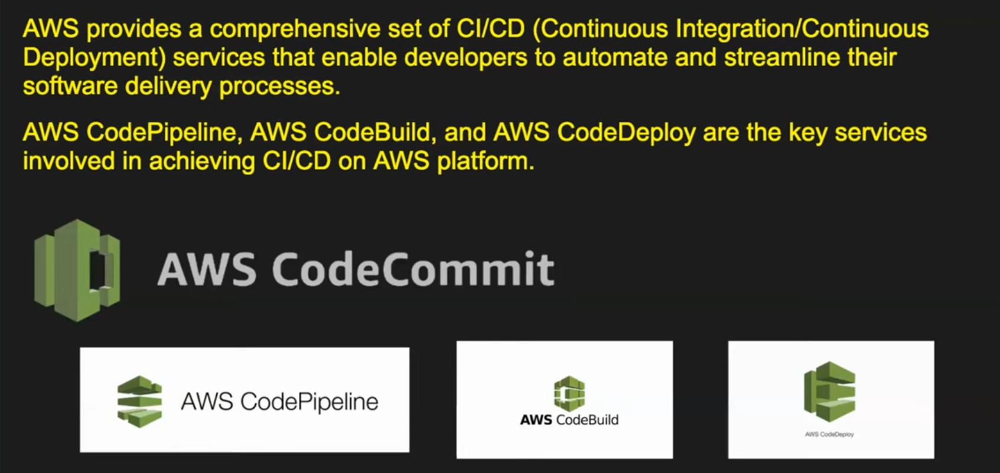
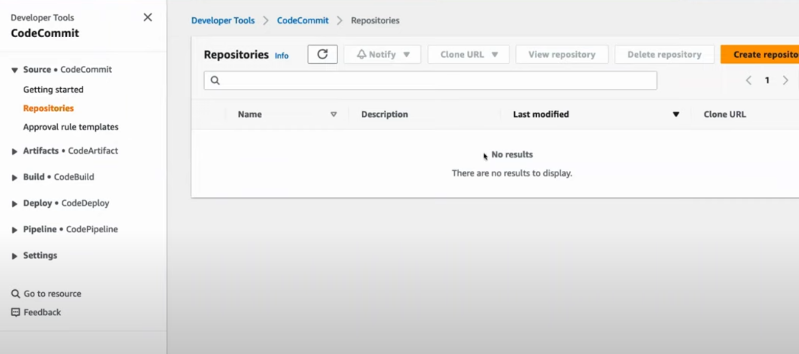
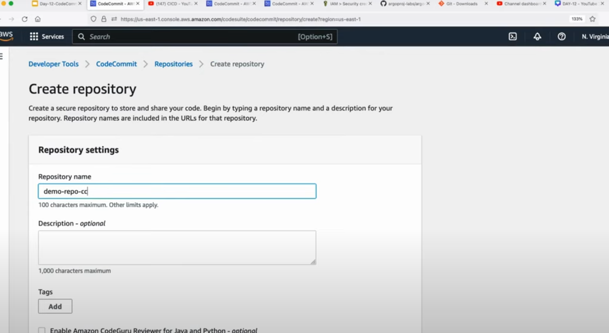

# AWS CodeCommit

**AWS CodeCommit is a fully managed source control service that allows you to host "Git repositories" in the AWS cloud.** It enables teams to collaborate on code in a secure, scalable, and reliable environment, similar to GitHub or Bitbucket, but fully integrated into the AWS ecosystem.

**Key Features:**

1. **Fully Managed**: AWS handles the scaling, availability, and underlying infrastructure, so you don’t have to manage servers or maintenance tasks.
2. **Git-based**: CodeCommit is based on Git, a popular distributed version control system, which means it supports familiar Git commands like `git push`, `git pull`, and `git clone`.
3. **Security**: CodeCommit integrates with AWS IAM for access control, allowing fine-grained permissions to be set for repositories, branches, or individual users. It also encrypts data at rest and in transit.
4. **Seamless Integration: It works well with other AWS services such as CodeBuild, CodePipeline, and CodeDeploy, enabling a full CI/CD (Continuous Integration/Continuous Deployment) pipeline.**
5. **Scalable**: CodeCommit can handle repositories of any size with no limits on the number of repositories or files.
6. **"Private" Repositories: Repositories hosted on CodeCommit are "private" by default, ensuring that your code is secure unless explicitly shared.**

**Use Cases:**

- **Collaborative Development**: Teams can collaborate on projects by cloning, pushing, and pulling changes using Git, just as they would with any Git-based repository.
- **CI/CD Pipelines**: CodeCommit works with AWS CodePipeline to trigger automated build and deployment processes when code changes are pushed.
- **Security-conscious Projects**: CodeCommit offers tighter security and compliance controls, making it ideal for organizations needing strong governance over their codebase.

**Example Workflow:**

1. **Create a Repository**:
   ```bash
   aws codecommit create-repository --repository-name MyRepo
   ```

2. **Clone the Repository**:
   ```bash
   git clone https://git-codecommit.us-east-1.amazonaws.com/v1/repos/MyRepo
   ```

3. **Push Changes**:
   After making code changes locally, you can push them to CodeCommit:
   ```bash
   git add .
   git commit -m "Initial commit"
   git push origin master
   ```

**Benefits:**

- **No Size Limits**: Unlike some other Git hosting services, there are no limits on the repository size or number of files.
- **Highly Secure**: Integrated with AWS Identity and Access Management (IAM) for fine-grained control over who can access your repositories.
- **AWS Ecosystem**: Deeply integrates with other AWS developer tools like CodeBuild, CodePipeline, and CodeDeploy to support complete DevOps workflows.

***Comparison with GitHub/Bitbucket:***
- **Similarities**: All these services offer Git-based source control, allowing teams to collaborate on code.
- **Differences**: CodeCommit is **private by default**, offers **better security controls** via IAM, and integrates more seamlessly with other AWS services. GitHub and Bitbucket, however, may offer more features for public repositories, open-source collaboration, and built-in project management tools.

In short, AWS CodeCommit is ideal for teams already using AWS or for projects that require tighter security and integration with AWS services.


---
**AWS CodeCommit supports CI/CD in AWS:**



**Code Commit Dashboard:**



**Create Repository under Region always (Avoid creating Repos under ROOT):**


