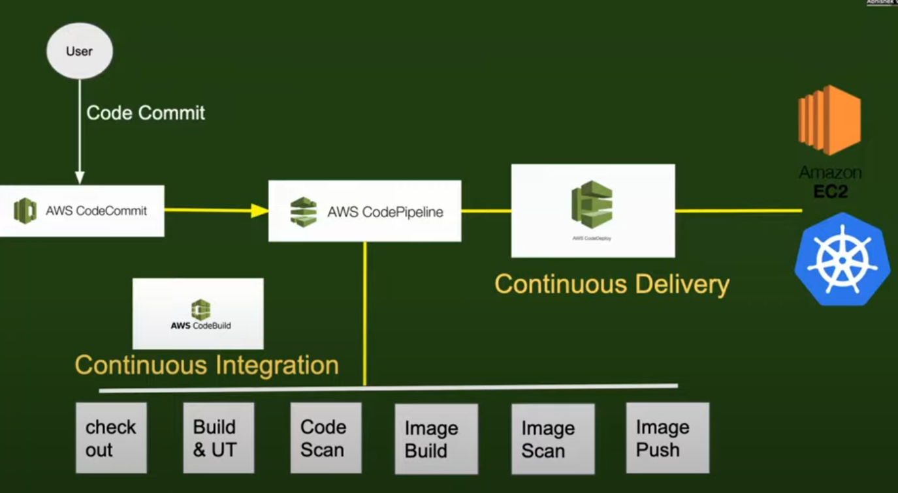

# AWS Code Pipeline

**AWS CodePipeline is a fully managed continuous integration and continuous delivery (CI/CD) service that automates the process of building, testing, and deploying applications.** It helps streamline software release workflows, enabling faster and more reliable delivery of application updates.

**Key Features:**

1. **Automated Workflow**: CodePipeline automates the process of deploying applications or infrastructure changes by breaking the workflow into stages like **Source**, **Build**, **Test**, and **Deploy**.
2. **Integration with AWS Services**: It integrates with various AWS services like **CodeCommit** (for source control), **CodeBuild** (for building), **CodeDeploy** (for deployment), and **CloudFormation** (for infrastructure as code). It also works with third-party tools like GitHub, Jenkins, and Bitbucket.
3. **Customizable Pipelines**: You can define your pipeline stages and integrate custom actions or services as part of the process. This flexibility allows it to fit a wide variety of workflows.
4. **Parallelism and Branch Support**: CodePipeline supports running multiple pipelines in parallel and can handle multiple branches for more complex workflows (e.g., testing on a development branch before deploying to production).
5. **Triggers and Notifications**: CodePipeline can trigger based on source code changes, time-based schedules, or manual approval steps. It integrates with **Amazon CloudWatch Events** for notifications and monitoring.
6. **Visualization**: The service provides a clear visual representation of the entire workflow, showing each stage's progress and status in real-time.

**Components of a Pipeline:**

A typical CodePipeline setup consists of several stages, each corresponding to a step in the CI/CD process:
1. **Source**: The first stage where the code or artifacts are sourced, typically from a repository like **AWS CodeCommit**, **GitHub**, or **S3**.
2. **Build**: Code is built and compiled in this stage, often using a service like **AWS CodeBuild** or a third-party tool like **Jenkins**.
3. **Test**: After the build, automated tests can be run to ensure the code is functioning as expected. This could involve unit tests, integration tests, or security scans.
4. **Deploy**: The final stage, where the application or infrastructure changes are deployed to an environment (e.g., staging, production) using services like **AWS CodeDeploy**, **Elastic Beanstalk**, or **CloudFormation**.
5. **Approval** (Optional): A manual approval step can be added before deployment, where an individual must approve the change before it proceeds to the next stage.

**How AWS CodePipeline Works**

1. **Source Stage**: CodePipeline is triggered by changes in the code repository (e.g., pushing changes to a Git repository).
2. **Build Stage**: Code is compiled, tested, and packaged by CodeBuild or another build tool.
3. **Test Stage**: Automated tests run on the built code to ensure functionality and quality.
4. **Deploy Stage**: If the tests pass, the code is deployed to the designated environment (e.g., production or staging).
5. **Monitoring and Feedback**: CodePipeline monitors the entire process and can notify teams of the status using Amazon CloudWatch, SNS, or other tools.

***Example Use Case:***

For a simple web application, you might have the following pipeline:
1. **Source**: Code is stored in **GitHub** or **AWS CodeCommit**.
2. **Build**: The code is built using **AWS CodeBuild** to package the application.
3. **Test**: Automated tests run using CodeBuild.
4. **Approval**: A manual approval is required before pushing changes to production.
5. **Deploy**: The application is deployed to **Elastic Beanstalk** or **ECS** for production.

***Example CodePipeline Definition (YAML):***

Here’s a basic structure for defining a CodePipeline using AWS CloudFormation:

```yaml
Resources:
  MyPipeline:
    Type: AWS::CodePipeline::Pipeline
    Properties:
      RoleArn: arn:aws:iam::123456789012:role/CodePipelineRole
      Stages:
        - Name: Source
          Actions:
            - Name: SourceAction
              ActionTypeId:
                Category: Source
                Owner: AWS
                Provider: S3
                Version: 1
              Configuration:
                S3Bucket: my-source-bucket
                S3ObjectKey: source.zip
        - Name: Build
          Actions:
            - Name: BuildAction
              ActionTypeId:
                Category: Build
                Owner: AWS
                Provider: CodeBuild
                Version: 1
              Configuration:
                ProjectName: MyBuildProject
        - Name: Deploy
          Actions:
            - Name: DeployAction
              ActionTypeId:
                Category: Deploy
                Owner: AWS
                Provider: CodeDeploy
                Version: 1
              Configuration:
                ApplicationName: MyCodeDeployApp
                DeploymentGroupName: MyDeploymentGroup
```

**Benefits:**

1. **Automated Workflow**: Eliminates manual steps, reducing the chances of human error and ensuring that your deployment process is reliable and consistent.
2. **Speed**: Continuous delivery enables fast, iterative deployments, allowing teams to ship updates more frequently.
3. **Flexibility**: Can integrate with a variety of tools, both AWS-native and third-party, allowing you to tailor the pipeline to your specific needs.
4. **Visibility and Feedback**: Provides real-time updates on the status of each stage, allowing teams to detect issues early and act on them quickly.

**Comparison with Other CI/CD Tools:**

- **Jenkins**: Jenkins is a popular open-source CI/CD tool with extensive plugins, but it requires manual setup and server management. CodePipeline is fully managed and integrated with AWS.
- **GitHub Actions**: GitHub Actions also provides CI/CD workflows but is more tightly integrated with GitHub repositories. CodePipeline is better suited for AWS-centric workflows, especially when combined with other AWS services.

In summary, **AWS CodePipeline** helps automate the release process by providing a fully managed CI/CD service that integrates deeply with AWS, making it ideal for teams using AWS for their application infrastructure.



---

