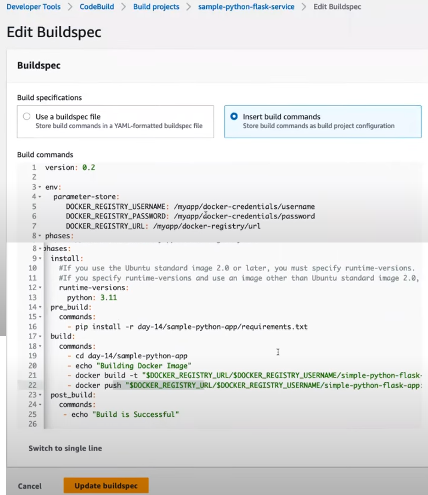
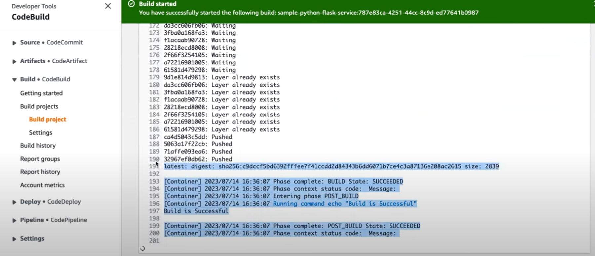

# AWS Code Build

**AWS CodeBuild is a fully managed continuous integration (CI) service that compiles your source code, runs tests, and produces software packages that are ready for deployment.** It eliminates the need to provision, manage, and scale your own build servers, as AWS handles these tasks automatically.

**Key Features of AWS CodeBuild:**

1. **Managed Build Environment**: AWS CodeBuild provides a fully managed build infrastructure, so you don’t need to manage servers or scaling.
2. **Scalability**: It automatically scales to handle multiple concurrent builds, allowing you to process builds in parallel without waiting in queues.
3. **Customizable Build Environments**: You can use predefined build environments (e.g., Ubuntu, Windows) or create custom build environments using Docker images.
4. **Pay-as-you-go**: You are charged only for the time your build is running, meaning you don’t have to worry about paying for idle build servers.
5. **Integration with AWS Services**: CodeBuild integrates with other AWS services such as **CodePipeline** (for CI/CD pipelines), **CodeCommit** (for source control), and **S3** (for storing artifacts).
6. **Security**: CodeBuild supports AWS Identity and Access Management (IAM) roles and policies, enabling secure access to resources and encrypted environment variables.

**Common Workflow:**

1. **Source Code**: The build process starts with source code, which can be stored in **AWS CodeCommit**, **GitHub**, **Bitbucket**, or **S3**.
2. **Buildspec.yml**: The build steps are defined in a **buildspec.yml** file, which specifies the phases of the build (install, pre-build, build, post-build), environment variables, test commands, and artifacts.
3. **Build Process**: CodeBuild compiles the code, runs tests, and packages the output (e.g., as a Docker image or executable).
4. **Artifacts**: The output artifacts (e.g., JAR files, Docker images) are stored in **S3** or used directly by other AWS services like **ECS**, **EKS**, or **Elastic Beanstalk**.
5. **Post-build**: After the build, logs and reports are available for review in the **AWS Management Console** or **Amazon CloudWatch Logs**.

**Example buildspec.yml:**
```yaml
version: 0.2

phases:
  install:
    commands:
      - echo Installing dependencies...
      - npm install
  pre_build:
    commands:
      - echo Running tests...
      - npm test
  build:
    commands:
      - echo Building the project...
      - npm run build
  post_build:
    commands:
      - echo Build completed.

artifacts:
  files:
    - '**/*'
  base-directory: build
```

This file instructs CodeBuild to:

1. Install dependencies.
2. Run tests.
3. Build the project.
4. Package the built files from the `build` directory as artifacts.

**Key Components of AWS CodeBuild:**

1. **Source**: The location of the source code (e.g., AWS CodeCommit, GitHub, Bitbucket, S3).
2. **Environment**: The operating system, runtime, and other build tools required to run the build process. You can use a managed image or a custom Docker image.
3. **Buildspec File**: Defines the steps of the build process, including phases such as install, pre-build, build, and post-build.
4. **Artifacts**: The output of the build process, which can be stored in S3, used for deployment, or passed to other AWS services.
5. **Logs**: CodeBuild provides logs via **Amazon CloudWatch Logs**, making it easy to debug and monitor the build process.

**Benefits:**
1. **No Server Management**: CodeBuild manages the infrastructure, allowing you to focus solely on building and testing your code.
2. **Cost-Efficient**: Pay only for the build time used, without needing to maintain idle build servers.
3. **Continuous Integration**: CodeBuild can be part of a CI/CD pipeline, automatically building and testing code after every commit or on a defined schedule.
4. **Custom Environments**: You can define custom build environments with any runtime, libraries, or frameworks your project requires.
5. **Security**: Environment variables and secrets can be securely stored in AWS Secrets Manager and injected during the build process.

**Integration with CodePipeline:**

**AWS "CodeBuild" can be integrated within "AWS CodePipeline" as part of an automated CI/CD workflow. CodePipeline can trigger CodeBuild jobs whenever there are changes in the source code repository, run the builds, and then pass the artifacts to the deployment stages.**

**Example Workflow:**

- **Source**: Code is checked into a repository (e.g., GitHub or CodeCommit).
- **Build: CodeBuild is triggered by CodePipeline to compile the source code, run tests, and package the output.**
- **Deploy**: The artifacts produced by CodeBuild are deployed to production using **AWS CodeDeploy** or another deployment service.

***Example Use Case:***

Suppose you're building a Node.js application. Every time code is pushed to a GitHub repository, AWS CodePipeline triggers CodeBuild. CodeBuild pulls the latest code, installs dependencies, runs tests, builds the application, and stores the packaged application in an S3 bucket for deployment. If the tests pass, CodePipeline moves the application to the next stage for deployment.

**Comparison with Other Build Tools:**

- **Jenkins: Jenkins requires managing your own infrastructure, while CodeBuild is fully managed.** Jenkins has a larger ecosystem of plugins, but CodeBuild is simpler to set up and integrates more tightly with AWS.
- **Travis CI/CircleCI**: These services offer similar CI functionality, but CodeBuild provides better integration with AWS services and allows custom environments through Docker.

In summary, **AWS CodeBuild** is an excellent choice for teams looking to automate their build and test processes in a scalable, cost-efficient way while seamlessly integrating with the AWS ecosystem.


---
# AWS Continuous Integration Demo

**1. Set Up GitHub Repository (instead of CodeCommit)**

The first step in our CI journey is to set up a GitHub repository to store our Python application's source code. If you already have a repository, feel free to skip this step. Otherwise, let's create a new repository on GitHub by following these steps:

- Go to github.com and sign in to your account.
- Click on the "+" button in the top-right corner and select "New repository."
- Give your repository a name and an optional description.
- Choose the appropriate visibility option based on your needs.
- Initialize the repository with a README file.
- Click on the "Create repository" button to create your new GitHub repository.

Great! Now that we have our repository set up, we can move on to the next step.

**2. Create an AWS CodePipeline:**

In this step, we'll create an AWS CodePipeline to automate the continuous integration process for our Python application. AWS CodePipeline will orchestrate the flow of changes from our GitHub repository to the deployment of our application. Let's go ahead and set it up:

- Go to the AWS Management Console and navigate to the AWS CodePipeline service.
- Click on the "Create pipeline" button.
- Provide a name for your pipeline and click on the "Next" button.
- For the source stage, select "GitHub" as the source provider.
- **Connect your GitHub account to AWS CodePipeline and select your repository.**
- Choose the branch you want to use for your pipeline.
- In the build stage, select "AWS CodeBuild" as the build provider.
- Create a new CodeBuild project by clicking on the "Create project" button.
- Configure the CodeBuild project with the necessary settings for your Python application, such as the build environment,  build commands, and artifacts.
- Save the CodeBuild project and go back to CodePipeline.
- Continue configuring the pipeline stages, such as deploying your application using AWS Elastic Beanstalk or any other suitable deployment option.
- Review the pipeline configuration and click on the "Create pipeline" button to create your AWS CodePipeline.

Awesome job! We now have our pipeline ready to roll. Let's move on to the next step to set up AWS CodeBuild.

**3. Configure AWS CodeBuild**

In this step, we'll configure AWS CodeBuild to build our Python application based on the specifications we define. CodeBuild will take care of building and packaging our application for deployment. Follow these steps:

- In the AWS Management Console, navigate to the AWS CodeBuild service.
- Click on the "Create build project" button.
- Provide a name for your build project.
- For the source provider, choose "AWS CodePipeline."
- Select the pipeline you created in the previous step.
- Configure the build environment, such as the operating system, runtime, and compute resources required for your Python application.
- Specify the build commands, such as installing dependencies and running tests. Customize this based on your application's requirements.
- Set up the artifacts configuration to generate the build output required for deployment.
- Review the build project settings and click on the "Create build project" button to create your AWS CodeBuild project.

Fantastic! With AWS CodeBuild all set up, we're now ready to witness the magic of continuous integration in action.

**4. Trigger the CI Process**

In this final step, we'll trigger the CI process by making a change to our GitHub repository. Let's see how it works:

- Go to your GitHub repository and make a change to your Python application's source code. It could be a bug fix, a new feature, or any other change you want to introduce.
- Commit and push your changes to the branch configured in your AWS CodePipeline.
- Head over to the AWS CodePipeline console and navigate to your pipeline.
- You should see the pipeline automatically kick off as soon as it detects the changes in your repository.
- Sit back and relax while AWS CodePipeline takes care of the rest. It will fetch the latest code, trigger the build process with AWS CodeBuild, and deploy the application if you configured the deployment stage.


---
**AWS Code Build - Build Command: Pass "env" vars to Docker Build step in Build Spec:**



**Code Build Dashboard, Steps and Progress:**


