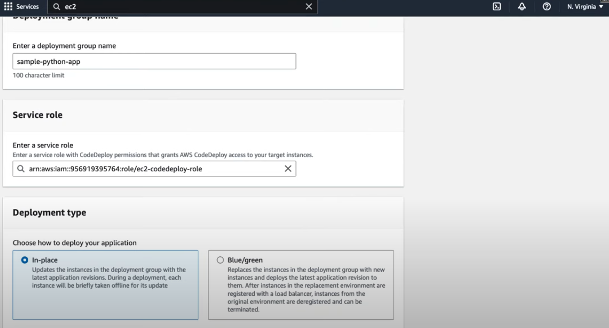

# AWS Code Deploy

**AWS CodeDeploy is a fully managed "deployment service" that automates the process of deploying applications to various compute services** like **Amazon EC2**, **AWS Lambda**, and **on-premises servers**. **It helps ensure that your application is deployed reliably, with minimal downtime, and can roll back automatically in case of deployment failures.**


**Key Features:**

1. **Automated Deployments: CodeDeploy automates application deployment to various environments, whether you're deploying code to EC2 instances, Lambda functions, or on-premise servers.**
2. **Blue/Green Deployments**: CodeDeploy supports **blue/green** deployments, which create a new environment (green) with the updated code while keeping the old environment (blue) active until the new one is fully validated.
3. **Rolling Updates**: CodeDeploy can perform **rolling updates**, gradually replacing instances with the new version of your application, minimizing downtime and reducing the risk of deploying a bad release.
4. **Canary Deployments**: You can deploy your code to a small subset of instances or Lambda functions first (canary), and if everything works as expected, continue deploying to the rest.
5. **Rollback Capabilities**: In case of failure during deployment, CodeDeploy can automatically rollback to a previously known good state, preventing downtime or broken applications.
6. **Custom Hooks**: CodeDeploy allows you to run custom scripts (hooks) before, during, or after deployments. These can perform tasks such as backing up databases, stopping services, or verifying health checks.
7. **Integration with CI/CD Pipelines**: CodeDeploy integrates seamlessly with **AWS CodePipeline**, enabling fully automated CI/CD workflows. It can also integrate with third-party tools like Jenkins or GitHub.

**AWS CodeDeploy Deployment Types:**

1. **In-place (Rolling) Deployments**:
   - **CodeDeploy replaces the application on the "same set of instances" or Lambda functions.**
   - **It stops the application, deploys the new version, and restarts the application.**
   - Ideal for EC2 instances and on-premise servers.
   - **Traffic is not shifted until the new version is fully deployed (it produces some downtime).**

2. **Blue/Green Deployments**:
   - **A new set of instances or environment (green) is launched, and the new application is deployed there.**
   - **After validation, the traffic is shifted from the old environment (blue) to the new one.**
   - **Reduces downtime and offers safer rollbacks.**

**How AWS CodeDeploy Works:**

1. **AppSpec File**: The application specification (`appspec.yml` or `appspec.json`) defines how the deployment will be executed, including how and where the application will be deployed, and what lifecycle event hooks will be used.
   - ***Example appspec.yml for EC2 deployments:***
   ```yaml
   version: 0.0
   os: linux
   files:
     - source: /
       destination: /var/www/html
   hooks:
     BeforeInstall:
       - location: scripts/install_dependencies.sh
         timeout: 300
     AfterInstall:
       - location: scripts/start_server.sh
         timeout: 300
   ```

2. **Deployment Group**: A deployment group is a collection of target instances (EC2, Lambda, or on-prem servers) where the application will be deployed.
3. **Deployment Configuration**: Defines how much of the fleet is updated at once during deployment. Examples include **CodeDeployDefault.AllAtOnce**, **CodeDeployDefault.HalfAtATime**, and custom configurations.
4. **Deployment Steps**: The steps include:
   - **Install**: CodeDeploy installs the application revision on the target instances.
   - **Application Stop**: Stop the current version of the application if required.
   - **Application Start**: Start the new version after the installation.
   - **Validation**: CodeDeploy runs health checks to verify the new application version is working as expected.

***Example CodeDeploy Workflow:***

1. **Source**: The application code is stored in a version control system like **AWS CodeCommit**, **GitHub**, or an **S3** bucket.
2. **Build**: The application is built and packaged using tools like **AWS CodeBuild** or a custom build server.
3. **Deploy: CodeDeploy deploys the application to EC2 instances or Lambda using the deployment group and strategy (blue/green, rolling updates).**
4. **Monitoring**: CodeDeploy monitors the deployment and provides status reports. If an issue occurs, it can roll back to the previous version.

**AWS CodeDeploy and AppSpec File (for EC2/On-Prem):**

- **`files` section**: Specifies the source files to deploy and the destination directories.
- **`hooks` section**: Defines lifecycle event hooks that allow you to run custom scripts (e.g., before or after installation).
- **`os`**: Defines the operating system of the deployment target (e.g., Linux, Windows).

***Example `appspec.yml` for a Lambda function:***
```json
{
  "version": 0.0,
  "Resources": [
    {
      "MyLambdaFunction": {
        "Type": "AWS::Lambda::Function",
        "Properties": {
          "Name": "MyLambdaFunction",
          "Alias": "production",
          "CurrentVersion": "$LATEST"
        }
      }
    }
  ]
}
```

***Blue/Green Deployment Example:***

For EC2 or Lambda:

1. **Deploy to Green Environment**: CodeDeploy launches a new environment (green) and deploys the updated application version there.
2. **Validation**: Run tests or health checks on the new environment.
3. **Shift Traffic**: Once the new environment is validated, CodeDeploy shifts traffic from the old (blue) environment to the new one.
4. **Rollback**: If any validation fails, CodeDeploy can roll back the deployment, reverting traffic to the old environment.

**Benefits:**

1. **Automated and Repeatable**: CodeDeploy allows for automated, repeatable, and consistent deployments, reducing the potential for human error.
2. **Minimizes Downtime**: Supports rolling updates, blue/green deployments, and canary releases to ensure minimal downtime during deployments.
3. **Scalable**: Can deploy applications to hundreds or thousands of instances across multiple environments simultaneously.
4. **Cross-platform**: Deploy to both cloud-based instances (EC2, Lambda) and on-premise servers.
5. **Rollback Capabilities**: Automatic rollback reduces the risk of bad deployments impacting production.

**Integration with AWS CodePipeline:**

**"CodeDeploy" can be integrated with "AWS CodePipeline" for a complete CI/CD solution. CodePipeline automates the process of building, testing, and deploying applications, and CodeDeploy handles the deployment stage. When new code is committed to a repository, CodePipeline can trigger the build and deployment process automatically.**

***Example Use Case:***

- **EC2 Deployments**: You have a web application hosted on an EC2 instance, and every time you push a new version of your application, AWS CodeDeploy automatically deploys the latest version, stops the old version, and starts the new one.
- **Lambda Deployments**: You have a microservices architecture built with AWS Lambda. CodeDeploy deploys new versions of your Lambda functions with blue/green deployments to ensure zero downtime.


---
### Comparison with Other Deployment Tools:

- **Jenkins**: Jenkins is an open-source CI/CD tool but requires more manual setup and server management. CodeDeploy is fully managed, integrates with AWS, and provides built-in support for advanced deployment strategies like blue/green.
- **GitHub Actions**: GitHub Actions provides CI/CD for GitHub repositories but lacks the deep AWS integration and deployment flexibility (e.g., blue/green, rolling) that CodeDeploy offers.

In summary, **AWS CodeDeploy** is a powerful, flexible service for automating deployments across AWS environments (EC2, Lambda) and even on-premise infrastructure, offering advanced deployment strategies like blue/green and canary.


---
[Code Deploy Guide (CD)](https://docs.aws.amazon.com/codedeploy/latest/userguide/welcome.html)

[Install Code Deploy Agent on Build/Deploy Instances](https://docs.aws.amazon.com/codedeploy/latest/userguide/codedeploy-agent-operations-install-ssm.html)

**Code Deploy Types:**

