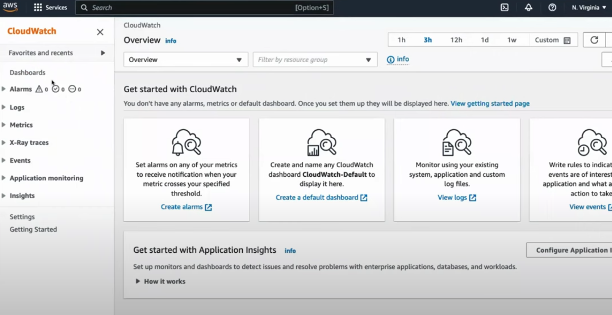
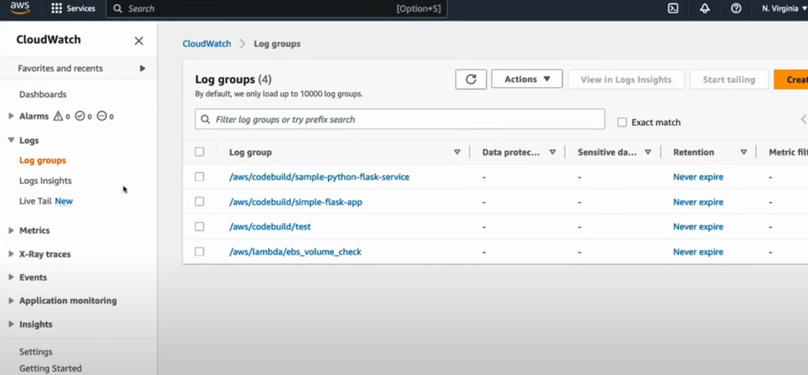
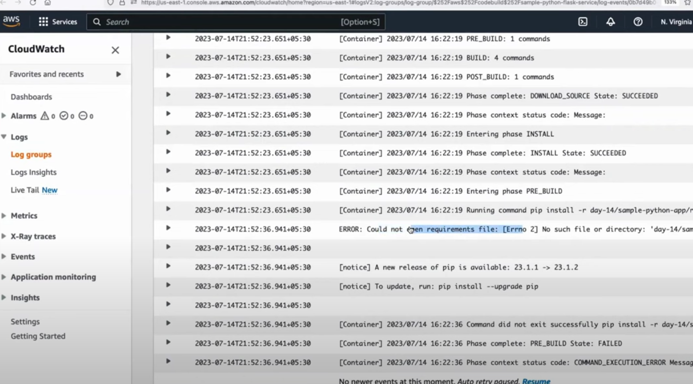
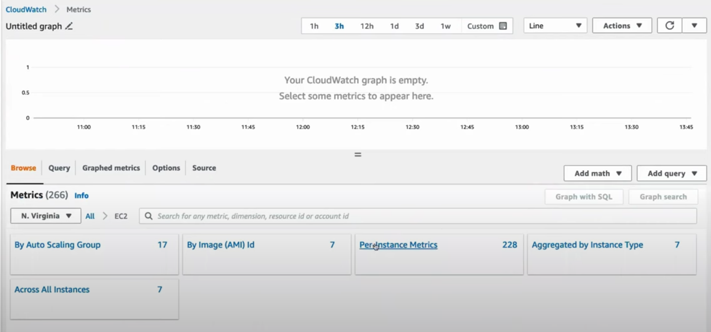
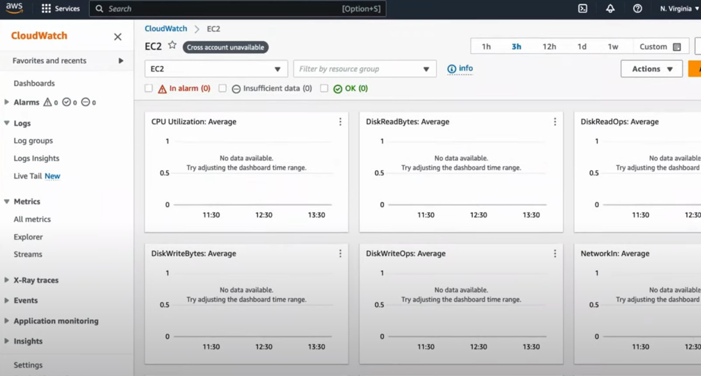
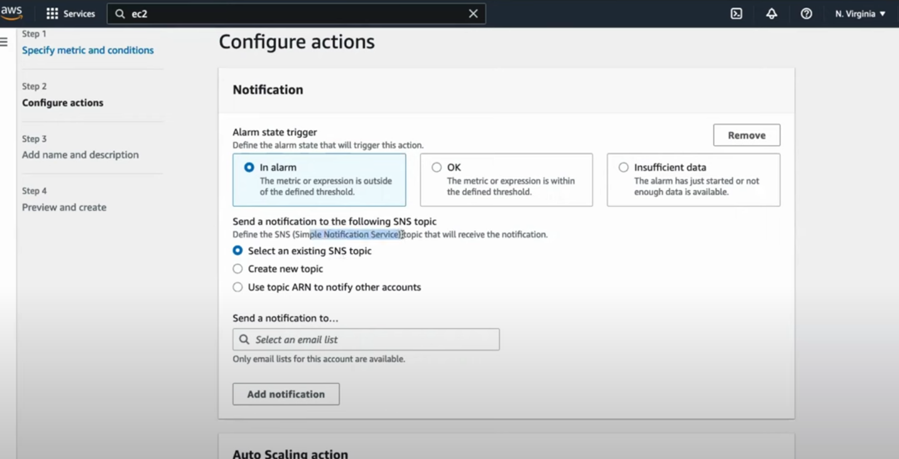
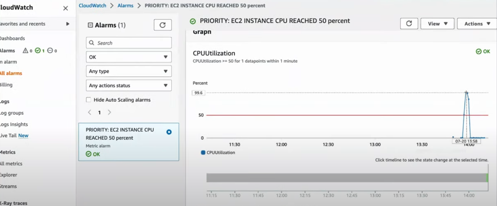
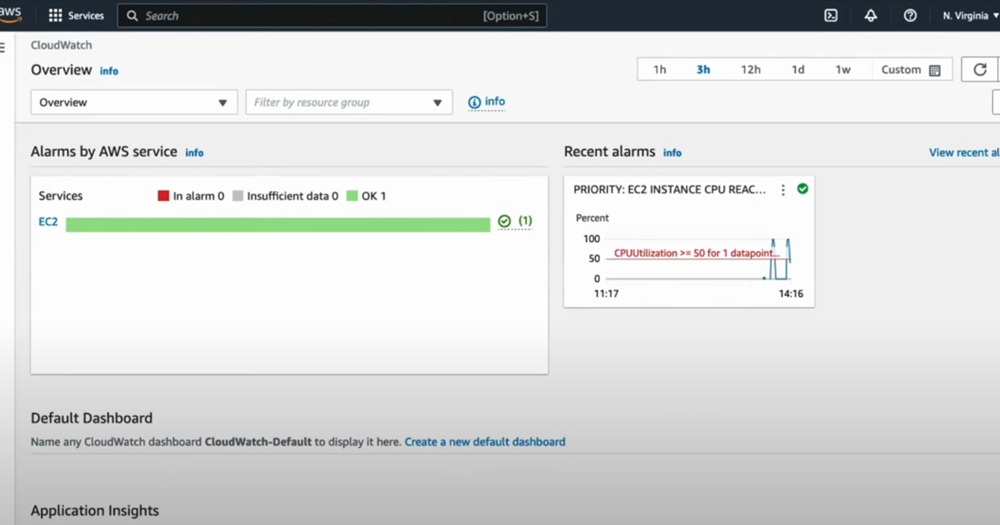

# AWS CLOUD WATCH 

**AWS CloudWatch is a comprehensive monitoring and observability service from Amazon Web Services that provides real-time insights into your AWS resources, applications, and infrastructure. It helps you collect, analyze, and act on data from logs, metrics, and events, enabling you to monitor performance, detect anomalies, and take automated actions to maintain the health and performance of your cloud environment.**

**Key Features:**

1. **Metrics Monitoring**:
   - **CloudWatch Metrics tracks key performance indicators (KPIs) like CPU utilization, memory usage, disk I/O, and network traffic** across AWS services such as **EC2**, **RDS**, **Lambda**, and **DynamoDB**.
   - You can create custom metrics to monitor specific parameters of your applications or infrastructure.
   - Metrics can be visualized in customizable dashboards.

2. **Logs Management**:
   - **CloudWatch Logs** allows you to collect, store, and manage log data from various AWS services (like **Lambda** and **EC2**) or on-premises servers.
   - You can perform real-time search, filter, and analysis on your logs to detect issues or troubleshoot errors.
   - Logs can be archived in **Amazon S3** or used for further analysis with services like **AWS Lambda** or **AWS Glue**.

3. **Alarms**:
   - CloudWatch Alarms monitor specific metrics and trigger notifications or automated actions when predefined thresholds are breached.
   - For example, you can set an alarm to notify you via **SNS** (Simple Notification Service) when an EC2 instance’s CPU usage exceeds 80%.
   - Alarms can also trigger auto-scaling actions to adjust resource capacity dynamically.

4. **Dashboards**:
   - **CloudWatch Dashboards provide a centralized, customizable view of your cloud resources. You can combine various metrics and alarms from different AWS services into a single view.**
   - Dashboards can be shared across your organization for real-time monitoring.

5. **Events (CloudWatch Events / EventBridge)**:
   - **CloudWatch Events (now integrated into "Amazon EventBridge") allows you to respond to changes in your AWS environment or custom events in real-time.**
   - **It can trigger automated actions** such as starting a Lambda function, notifying administrators, or launching an EC2 instance **when an event occurs (e.g., a code push, an AWS API call, or a scaling event).**

6. **Insights**:
   - **CloudWatch Logs Insights** offers advanced log querying and analysis, allowing you to derive insights from large volumes of log data using a powerful query language. You can search, visualize, and analyze logs to debug applications or identify operational issues.

7. **ServiceLens**:
   - **CloudWatch ServiceLens** provides end-to-end observability for applications, integrating metrics, logs, and traces to help you visualize performance bottlenecks and pinpoint failures across your distributed applications.

8. **Synthetics**:
   - **CloudWatch Synthetics** lets you create canary scripts that simulate user interactions with your applications. This is useful for proactively monitoring API endpoints, websites, and services before end users are affected.

9. **CloudWatch Container Insights**:
   - **Provides observability for containerized applications running on "Amazon ECS", "EKS", and "Kubernetes". It collects, aggregates, and summarizes metrics and logs from your containers to help you understand the performance of your workloads.**

**How AWS CloudWatch Works:**

1. **Data Collection**: CloudWatch collects metrics from AWS services (like EC2, Lambda, and RDS) or custom metrics from your applications.
2. **Alarms and Events**: You can set up alarms and create rules to monitor these metrics, triggering actions (like sending notifications or scaling services) when certain thresholds are reached.
3. **Logs**: CloudWatch aggregates and stores logs from AWS services, which you can search and analyze using CloudWatch Logs Insights.
4. **Dashboards**: CloudWatch enables you to visualize metrics and alarms in real time through fully customizable dashboards.

***Example CloudWatch Alarms:***
```bash
aws cloudwatch put-metric-alarm --alarm-name "HighCPUUtilization" \
--metric-name "CPUUtilization" --namespace "AWS/EC2" \
--statistic "Average" --period 300 --threshold 80 \
--comparison-operator "GreaterThanThreshold" --dimensions "Name=InstanceId,Value=i-1234567890abcdef0" \
--evaluation-periods 1 --alarm-actions "arn:aws:sns:us-east-1:123456789012:MyTopic"
```
This command creates an alarm that triggers if the average CPU utilization of the specified EC2 instance exceeds 80% for one evaluation period.

**Common Use Cases:**

1. **Performance Monitoring**: Track the performance of AWS resources like EC2 instances, RDS databases, and load balancers. Set alarms to receive alerts when performance degrades.
2. **Cost Optimization**: Monitor usage metrics to detect idle or underused resources and take action (e.g., scale down or terminate instances) to save costs.
3. **Log Monitoring**: Aggregate and analyze logs from various services to troubleshoot issues, detect security breaches, or understand user behavior.
4. **Proactive Alerting**: Set up alarms for real-time notifications when key thresholds are met, such as high memory usage or low disk space, to prevent service interruptions.
5. **Automated Actions**: Trigger Lambda functions or auto-scaling actions in response to specific events or metric thresholds, reducing the need for manual intervention.
6. **Observability for Containers**: Use Container Insights to monitor the health and performance of your containerized applications running on ECS, EKS, or Kubernetes.

**Benefits of AWS CloudWatch:**

1. **Comprehensive Monitoring**: Provides a unified platform to monitor metrics, logs, events, and application traces from AWS resources and custom applications.
2. **Scalable**: Automatically scales with your infrastructure, from a single instance to thousands of services or applications.
3. **Real-time Alerts and Automation**: Detect issues early and automatically take corrective actions, reducing downtime and improving reliability.
4. **Cost-effective**: CloudWatch uses a pay-as-you-go pricing model, where you only pay for what you monitor, such as custom metrics, dashboards, or log data.
5. **Tight Integration with AWS Services**: CloudWatch integrates seamlessly with other AWS services like **EC2**, **Lambda**, **Auto Scaling**, and **SNS** for automated monitoring and management.

**Integration with Other AWS Services:**

- **AWS Auto Scaling**: CloudWatch Alarms can trigger Auto Scaling to add or remove instances based on defined thresholds.
- **AWS Lambda**: CloudWatch Events can trigger Lambda functions for automated responses to specific events or metrics.
- **Amazon RDS**: CloudWatch monitors database performance and allows setting alarms for high memory or CPU usage.
- **Amazon ECS**: Use Container Insights for monitoring Docker containers in ECS clusters.
  
***Example Use Case: Monitoring EC2 Instances***

1. CloudWatch collects metrics like CPU utilization, network in/out, and disk activity for your EC2 instances.
2. You can create alarms to notify you when CPU usage exceeds 80% for a specified period of time.
3. If the alarm is triggered, you can configure an action like sending a notification via SNS or scaling up your Auto Scaling group.

In summary, **AWS CloudWatch** is a powerful tool for monitoring and managing your AWS infrastructure and applications, providing real-time insights through metrics, logs, alarms, and dashboards. It enables you to automate responses to system changes, optimize performance, and maintain high availability across your cloud environment.

---
**What is AWS CloudWatch?**

AWS CloudWatch is a powerful monitoring and observability service provided by Amazon Web Services. It enables you to gain insights into the performance, health, and operational aspects of your AWS resources and applications. CloudWatch collects and tracks metrics, collects and monitors log files, and sets alarms to alert you on certain conditions.

**Advantages of AWS CloudWatch:**

    Comprehensive Monitoring: CloudWatch allows you to monitor various AWS resources such as EC2 instances, RDS databases, Lambda functions, and more. You get a unified view of your entire AWS infrastructure.

    Real-Time Metrics: It provides real-time monitoring of metrics, allowing you to respond quickly to any issues or anomalies that might arise.

    Automated Actions: With CloudWatch Alarms, you can set up automated actions like triggering an Auto Scaling group to scale in or out based on certain conditions.

    Log Insights: CloudWatch Insights lets you analyze and search log data from various AWS services, making it easier to troubleshoot problems and identify trends.

    Dashboards and Visualization: Create custom dashboards to visualize your application and infrastructure metrics in one place, making it easier to understand the overall health of your system.

**CloudWatch helps address several critical challenges, including:**

    Resource Utilization: Tracking resource utilization and performance metrics to optimize your AWS infrastructure efficiently.
    Proactive Monitoring: Identifying and resolving issues before they impact your applications or users.
    Troubleshooting: Analyzing logs and metrics to troubleshoot problems and reduce downtime.
    Scalability: Automatically scaling resources based on demand to ensure optimal performance and cost efficiency.

**Practical Use Cases of AWS CloudWatch:**

    Auto Scaling: CloudWatch can trigger Auto Scaling actions based on defined thresholds. For example, you can automatically scale in or out based on CPU utilization or request counts.

    Resource Monitoring: Monitor EC2 instances, RDS databases, DynamoDB tables, and other AWS resources to gain insights into their performance and health.

    Application Insights: Track application-specific metrics to monitor the performance of your applications and identify potential bottlenecks.

    Log Analysis: Use CloudWatch Logs Insights to analyze log data, identify patterns, and troubleshoot issues in real-time.

    **Billing and Cost Monitoring: CloudWatch can help you monitor your AWS billing and usage patterns, enabling you to optimize costs.**


---
### CloudWatch Logs Insights

**CloudWatch Logs Insights is a feature within AWS CloudWatch that allows you to search, analyze, and visualize logs from AWS services in near real-time. It provides a "powerful Query Language" that helps you to derive actionable insights from large volumes of log data stored in "CloudWatch Logs".**

**Key Features:**

1. **Advanced Log Search: You can perform fast searches on large amounts of log data using a rich query language, filtering and extracting specific information.**
2. **Log Aggregation**: It helps you aggregate logs from various AWS services (such as **AWS Lambda**, **EC2**, **API Gateway**, **VPC Flow Logs**, etc.) or custom applications.
3. **Real-Time Log Analysis**: Query logs in real-time to troubleshoot errors, identify performance bottlenecks, or gain operational insights.
4. **Custom Dashboards: You can visualize log data in CloudWatch Dashboards by creating widgets for specific queries and metrics.**
5. **Saved Queries**: Frequently used queries can be saved for quick reuse.
6. **Visualization**: Results of log queries can be visualized in various formats like time series graphs, which are helpful for trend analysis.

**CloudWatch Logs Insights Query Language:**

CloudWatch Logs Insights uses a SQL-like query language that allows you to filter, parse, and aggregate log data.

***Example Queries:***

1. **Basic Query: Find all log entries containing the word "ERROR".**
   ```sql
   fields @timestamp, @message
   | filter @message like /ERROR/
   | sort @timestamp desc
   ```

2. **Top IP Addresses by Request Count**: For an application running on EC2 or API Gateway.
   ```sql
   fields @timestamp, @message, clientIP
   | stats count(clientIP) as requestCount by clientIP
   | sort requestCount desc
   | limit 10
   ```

3. **Count Errors Over Time**: Display the count of errors within a time range.
   ```sql
   fields @timestamp, @message
   | filter @message like /ERROR/
   | stats count() as errorCount by bin(5m)
   ```

4. **Parse Custom Logs**: Extract fields from a custom log format.
   ```sql
   fields @timestamp, @message
   | parse @message "[ERROR] * - *" as errorType, errorDetails
   | filter errorType = "Critical"
   | sort @timestamp desc
   ```

**Common Use Cases:**

1. **Troubleshooting**: Quickly locate log entries related to errors, performance issues, or other anomalies within your applications. For example, filter logs to find all occurrences of a specific error message.
2. **Application Monitoring**: Aggregate log data to monitor key application behaviors, such as API request patterns, top IP addresses, or response times.
3. **Security Auditing**: Analyze logs to detect suspicious activities, such as unauthorized access attempts or unusual network traffic patterns.
4. **Cost Optimization**: Analyze VPC Flow Logs to understand network usage and optimize infrastructure costs.

***Example: Query for Lambda Execution Logs***

This query retrieves all logs for AWS Lambda invocations where the execution took longer than 3 seconds.
```sql
fields @timestamp, @requestId, @message
| filter @message like /REPORT/
| filter duration > 3000
| sort @timestamp desc
```

**Querying for VPC Flow Logs:**
You can analyze VPC Flow Logs to check traffic patterns or detect anomalies.
```sql
fields @timestamp, srcAddr, dstAddr, action
| filter action = "REJECT"
| stats count(*) as rejectCount by srcAddr, dstAddr
| sort rejectCount desc
```

**Integration with Dashboards:**

**You can add query results from Logs Insights to CloudWatch Dashboards, which helps visualize log patterns and trends over time. This is especially useful for real-time monitoring of key log metrics like error rates or request latencies.**

**Steps to Use CloudWatch Logs Insights:**

1. **Go to CloudWatch Logs Console**: Navigate to the AWS CloudWatch console and select **Logs Insights**.
2. **Choose a Log Group**: Select the log group that you want to query, such as the log group for your EC2 instances, Lambda functions, or API Gateway.
3. **Run a Query**: Write a query using the Logs Insights query language and run it to see the results in real-time.
4. **Analyze**: Visualize the query results using charts or time series to detect trends or patterns.
5. **Save Query**: Save the query for future use or create CloudWatch Alarms based on the log data.

***Example Workflow:***

1. Your EC2 instance is facing intermittent performance issues.
2. You use **CloudWatch Logs Insights** to query logs from the EC2 instance and filter for high CPU usage or memory errors.
3. Based on the log data, you identify the source of the problem (e.g., a faulty application or resource constraint).
4. You visualize CPU usage trends over time by creating a graph in a CloudWatch Dashboard for continuous monitoring.

**Benefits:**

- **Scalability**: It scales to handle vast amounts of log data across distributed AWS resources and can provide near real-time results.
- **Cost-Effective**: You pay based on the queries run and the amount of data scanned, so you can use it as needed without incurring high costs.
- **Ease of Use**: It provides an intuitive query language and user-friendly interface, making log analysis easy even for large data sets.

In summary, **CloudWatch Logs Insights** is a powerful tool for real-time log data analysis, helping you troubleshoot applications, monitor operational data, and gain insights from AWS resource logs using custom queries and visualization techniques.


---
**Cloud Watch Dashboard:**



**CW Log Groups created per each Project Automatically:**



**CW Logs of one Sample Project:**



**CW Metrics Dashboard by Types:**



**Metrics of Component/Services:**



**Create CW Alarm from Metric conditions:**



**Alarm Monitor:**



**Alarm Overview:**


