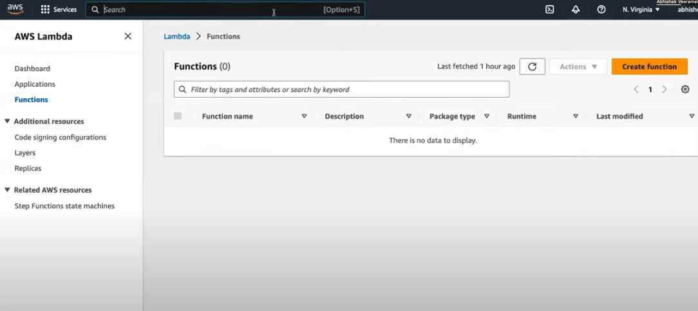
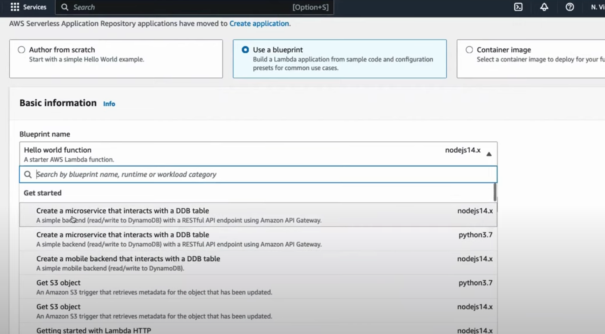
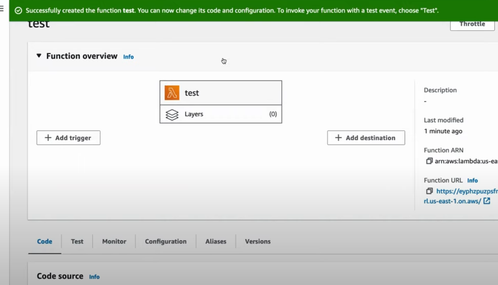
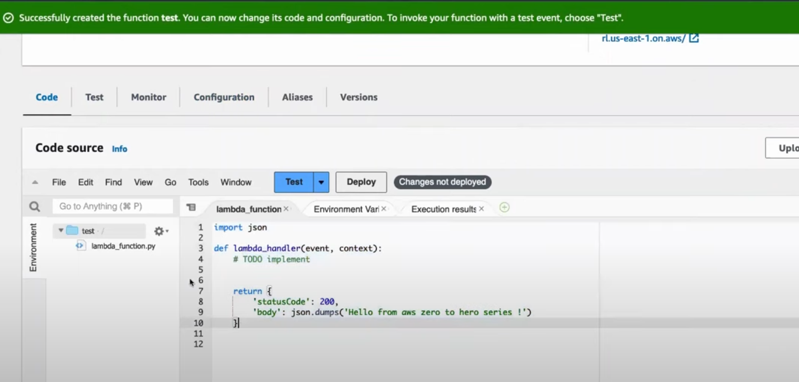
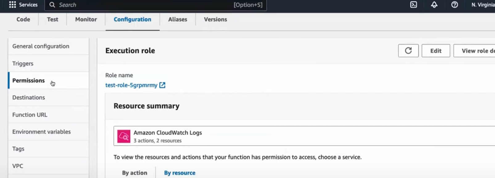

# Serverless Computing & AWS Lambda


---
### Serverless Computing

**Serverless computing is a cloud computing model where the "cloud provider" automatically manages the infrastructure, including scaling, patching, and provisioning servers.** Developers can focus purely on writing code, while the cloud service takes care of all operational concerns. **This model enables applications to scale automatically based on demand, and you are only charged for the computation of resources when your code is actually running.**


---
### AWS Lambda

**AWS Lambda is a popular serverless computing service provided by Amazon Web Services (AWS). It allows you to run code in response to specific events**, such as changes to data in an S3 bucket, updates in a DynamoDB table, or HTTP requests via API Gateway, without provisioning or managing servers.

### Key Concepts of AWS Lambda:

1. **Event-driven: Lambda functions are triggered by events**, such as HTTP requests, file uploads, or database updates.
   
2. **Stateless: Each invocation of a Lambda function is independent and does not share any state.** For persistent storage, you rely on external services like DynamoDB or S3.
   
3. **Execution Environment**: AWS Lambda provides a fully managed environment that **automatically scales to handle multiple requests simultaneously.** It supports multiple programming languages like Python, Node.js, Java, Go, and more.
   
4. **Pay-as-you-go Pricing**: You **only pay for the actual compute time**, measured in milliseconds, which is used while your function is executing.

**Benefits of AWS Lambda:**

- **No server management**: You don’t need to worry about servers, operating systems, or managing infrastructure.
- **Automatic scaling**: AWS Lambda automatically scales your applications by running code in response to each trigger.
- **Reduced costs**: You only pay for the compute time you consume, which can lead to cost savings, especially for intermittent workloads.
- **Fast deployments**: Code changes can be deployed quickly without the need to restart or reconfigure servers.

***Examples of Use Cases:***
- **Real-time file processing**: Automatically process data or images uploaded to S3.
- **APIs: Create RESTful services using Lambda behind an API Gateway.**
- **Event-driven applications: Respond to database changes, message queue events, or real-time notifications.**
- **IoT applications**: Process data from IoT devices and sensors.


---
**Complete Example Case: ResT API behind an API Gateway in Java:**

Steps of an AWS Lambda function in Java that handles an API Gateway event and returns a simple response.

**I. Create the Lambda Handler Class:**

This is a simple Java class implementing AWS Lambda's `RequestHandler` interface, which allows you to handle the incoming request and send a response.

```java
package com.example.lambda;

import com.amazonaws.services.lambda.runtime.Context;
import com.amazonaws.services.lambda.runtime.RequestHandler;
import com.amazonaws.services.lambda.runtime.events.APIGatewayProxyRequestEvent;
import com.amazonaws.services.lambda.runtime.events.APIGatewayProxyResponseEvent;

public class HelloWorldLambda implements RequestHandler<APIGatewayProxyRequestEvent, APIGatewayProxyResponseEvent> {

    @Override
    public APIGatewayProxyResponseEvent handleRequest(APIGatewayProxyRequestEvent request, Context context) {
        // Log some information
        context.getLogger().log("Received request: " + request.getBody());

        // Create a response
        APIGatewayProxyResponseEvent response = new APIGatewayProxyResponseEvent();
        response.setStatusCode(200);
        response.setBody("Hello, " + (request.getBody() == null ? "World" : request.getBody()) + "!");

        return response;
    }
}
```

**II. Maven `pom.xml` Configuration:**

If you're using Maven to build your project, your `pom.xml` should include the AWS SDK and other dependencies:

```xml
<project xmlns="http://maven.apache.org/POM/4.0.0"
         xmlns:xsi="http://www.w3.org/2001/XMLSchema-instance"
         xsi:schemaLocation="http://maven.apache.org/POM/4.0.0 http://maven.apache.org/xsd/maven-4.0.0.xsd">
    <modelVersion>4.0.0</modelVersion>

    <groupId>com.example</groupId>
    <artifactId>lambda-java</artifactId>
    <version>1.0-SNAPSHOT</version>
    <packaging>jar</packaging>

    <dependencies>
        <!-- AWS Lambda Core dependency -->
        <dependency>
            <groupId>com.amazonaws</groupId>
            <artifactId>aws-lambda-java-core</artifactId>
            <version>1.2.1</version>
        </dependency>

        <!-- AWS Lambda Events dependency -->
        <dependency>
            <groupId>com.amazonaws</groupId>
            <artifactId>aws-lambda-java-events</artifactId>
            <version>3.11.0</version>
        </dependency>

        <!-- Logging -->
        <dependency>
            <groupId>ch.qos.logback</groupId>
            <artifactId>logback-classic</artifactId>
            <version>1.2.3</version>
        </dependency>
    </dependencies>

    <build>
        <plugins>
            <!-- Maven Shade plugin to create an uber-jar -->
            <plugin>
                <groupId>org.apache.maven.plugins</groupId>
                <artifactId>maven-shade-plugin</artifactId>
                <version>3.2.4</version>
                <executions>
                    <execution>
                        <phase>package</phase>
                        <goals>
                            <goal>shade</goal>
                        </goals>
                    </execution>
                </executions>
            </plugin>
        </plugins>
    </build>
</project>
```

**III. Deploying the Lambda Function:**

Once you've built your project, package it into a JAR using Maven:

```bash
mvn clean package
```

This will create a JAR file, which can be uploaded to AWS Lambda. You can **deploy your Lambda function using the AWS Management Console, AWS CLI, or infrastructure as code tools like AWS CloudFormation or Terraform.**

**IV. Creating API Gateway for Lambda:**

**To invoke this Lambda function via an HTTP endpoint, you can create an API Gateway and link it to your Lambda. This would allow HTTP requests to trigger the Lambda, which would then process the request and return an HTTP response.**

Here’s how to set up an API Gateway to trigger your AWS Lambda function and deploy everything using the AWS Management Console.

**Step 1: Create the Lambda Function:**

1. **Go to AWS Lambda**: In the AWS Management Console, navigate to **Lambda**.
2. **Create Function**:
    - Choose **Create function**.
    - Select **Author from scratch**.
    - Name your function (e.g., `HelloWorldLambda`).
    - Runtime: Choose **Java Version** (depending on your version).
    - Role: Create a new role with basic Lambda permissions (or choose an existing role if one is already configured).
    - Click **Create function**.

3. **Upload the Code**:
    - In the Lambda function dashboard, scroll down to the **Function code** section.
    - Under **Code source**, click on **Upload from** → **.zip file** and **upload the JAR file** created from your Maven project.

4. **Test the Lambda**:
    - Once the code is uploaded, you can test it by creating a test event in the **Test** section of the Lambda dashboard.
    - Select **Create a new test event**, use the `APIGatewayProxyRequestEvent` format, and run the test.
    - Ensure your Lambda works and logs a response.

**Step 2: Create an API Gateway:**

1. **Go to API Gateway**:
    - In the AWS Management Console, search for **API Gateway** and navigate to it.

2. **Create a New API**:
    - Click **Create API**.
    - Choose **HTTP API** or **REST API**. For simplicity, let's choose **HTTP API**.
    - Click **Build**.

3. **Configure API Route**:
    - In the **Define routes** section, add a route for your API.
        - Method: **GET**.
        - Path: **/hello**.
    - Click **Next**.

4. **Integrate Lambda with API Gateway**:
    - In the **Add integration** step, choose **Lambda**.
    - Select the **Lambda function** created earlier (e.g., `HelloWorldLambda`).
    - Click **Next** and **Create**.

5. **Deploy API**:
    - After the API is created, you will get a public URL endpoint.
    - You can now invoke your Lambda function using this HTTP API Gateway URL.

**Step 3: Test the API Gateway:**

1. **Invoke the API**: 
    - Copy the public URL provided by API Gateway, which should be something like: 
      ```
      https://<api-id>.execute-api.<region>.amazonaws.com/hello
      ```
    - Open a browser or use a tool like `curl` or Postman to send a `GET` request to the URL.

2. **Response**: 
    - You should see the response from your Lambda function, e.g., `Hello, World!`.

**Step 4: Monitor and Logs:**

1. **View Logs**: Go to **CloudWatch** to check the logs of your Lambda function. This is helpful for debugging and monitoring the function's execution.

2. **API Gateway Logs**: You can also enable logging in API Gateway for more detailed request and response logging.

***Bonus: Automate Deployment with AWS CLI:***
**You can use AWS CLI to deploy the Lambda and API Gateway automatically, making it easier for subsequent deployments.**

```bash
# Deploy Lambda function
aws lambda create-function \
  --function-name HelloWorldLambda \
  --runtime java11 \
  --role arn:aws:iam::<account-id>:role/<your-lambda-role> \
  --handler com.example.lambda.HelloWorldLambda::handleRequest \
  --zip-file fileb://target/lambda-java-1.0-SNAPSHOT.jar \
  --timeout 15

# Create API Gateway and integrate with Lambda
aws apigatewayv2 create-api \
  --name "HelloWorldAPI" \
  --protocol-type HTTP \
  --target arn:aws:lambda:<region>:<account-id>:function:HelloWorldLambda
```


---
### Summary of Serverless Computing and AWS Lambda:

It's not about eliminating servers altogether. Instead, **serverless computing is a cloud computing execution model** where you, as a developer, don't have to manage servers directly. You focus solely on writing and deploying your code, **where the cloud provider takes care of all the underlying infrastructure.**

**Understanding AWS Lambda:**

In this serverless landscape, AWS Lambda shines as a leading service. **AWS Lambda is a compute service that lets you run your code in response to events without the need to provision or manage servers.** It automatically scales your applications based on incoming requests, so you don't have to worry about capacity planning or dealing with server maintenance.

**How Lambda Functions Fit into the Serverless World:**

At the heart of AWS Lambda are **"Lambda functions"**. These **are individual units of code that perform specific tasks**. Think of them as small, single-purpose applications that run independently.

Here's how Lambda functions fit into the serverless world:

1. **Event-Driven Execution: Lambda functions are triggered by events.** An event could be anything, like a new file being uploaded to Amazon S3, a request hitting an API, or a specific time on the clock. When an event occurs, Lambda executes the corresponding function.

2. **No Server Management**: As a developer, you don't need to worry about managing servers. **AWS handles everything behind the scenes.** You just upload your code, configure the trigger, and Lambda takes care of the rest.

3. **Automatic Scaling**: Whether you have one user or one million users, Lambda scales automatically. Each function instance runs independently, ensuring that your application can handle any level of incoming traffic without manual intervention.

4. **Pay-per-Use**: One of the most attractive features of serverless computing is cost efficiency. With Lambda, you pay only for the compute time your code consumes. When your code isn't running, you're not charged.

5. **Supported Languages**: Lambda supports multiple programming languages like Node.js, Python, Java, Go, and more. You can choose the language you are comfortable with or that best fits your application's needs.

**Real-World Use Cases:**

Now, let's explore some real-world use cases to better understand how AWS Lambda can be applied:

1. **Automated Image Processing**: Imagine you have a photo-sharing app, and users upload images every day. You can use Lambda to automatically resize or compress these images as soon as they are uploaded to S3.

2. **Chatbots and Virtual Assistants**: Build interactive chatbots or voice-controlled virtual assistants using Lambda. These assistants can perform tasks like answering questions, fetching data, or even controlling smart home devices.

3. **Scheduled Data Backups**: Use Lambda to create scheduled tasks for backing up data from one storage location to another, ensuring data resilience and disaster recovery.

4. **Real-Time Analytics**: Lambda can process streaming data from IoT devices, social media, or other sources, allowing you to perform real-time analytics and gain insights instantly.

5. **API Backends**: Develop scalable API backends for web and mobile applications using Lambda. It automatically handles the incoming API requests and executes the corresponding functions.


---
**Lambda Dashboard:**



**Create Lambda Function:**



**Lambda Overview - Triggers:**



**Lambda Overview - Source Code:**



**Add Necessary Permissions to Lambda Function, e.g. in case of accessing S3 resources:**

