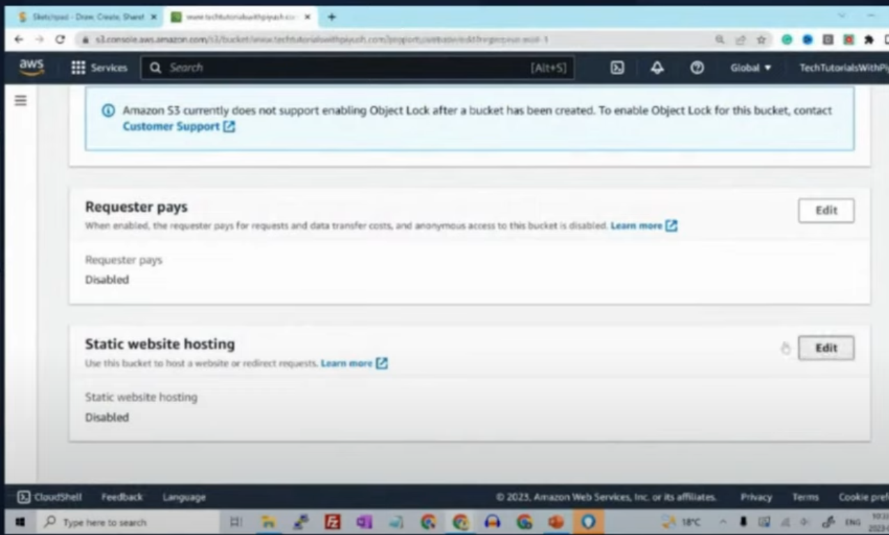
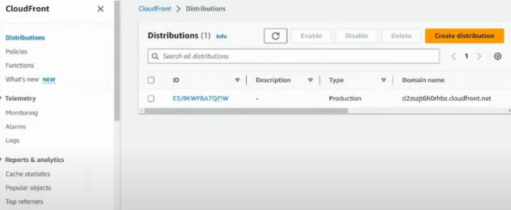
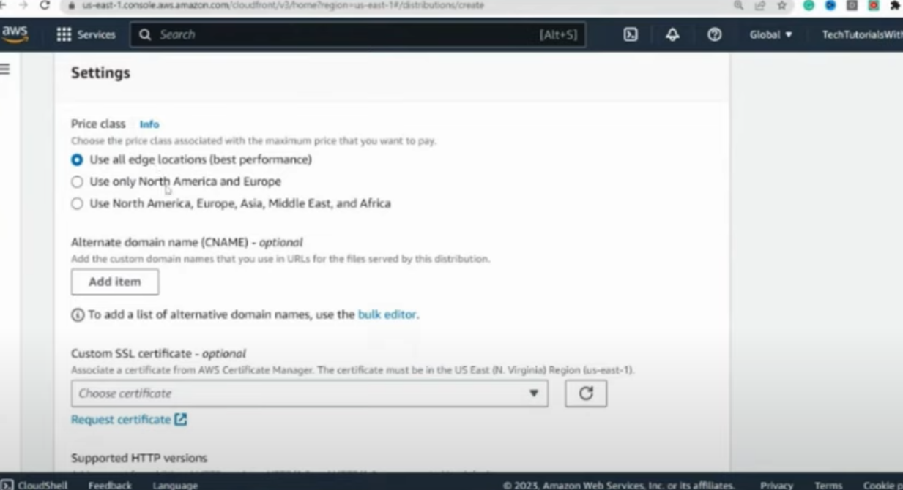

# CDN and AWS Cloud Front

**CDN (Content Delivery Network) and Amazon CloudFront are both technologies used to deliver web content "efficiently"**, but let's break them down:

---
### CDN (Content Delivery Network)

**A CDN is a globally distributed network of servers that work together to deliver content, like web pages, images, videos, and scripts, to users based on their geographic location. "The primary goal is to minimize latency" by reducing the physical distance between the server and the user.**

**How it works:**

1. **Content Replication: CDN providers replicate content across multiple servers located in different regions (edge locations).**
2. **User Request:** When a user requests content (e.g., visiting a website), the CDN directs the request to the closest server (edge location) to the user.
3. **Content Delivery:** This reduces latency and improves the load times of websites, providing a faster user experience.

**Benefits:**

- **Faster Load Times: Content is served from servers closer to the user.**
- **Improved Reliability:** If one server fails, others can step in to serve content.
- **Scalability:** CDNs can handle high traffic spikes (e.g., during product launches or sales).
- **Bandwidth Efficiency:** Caching content at multiple points reduces the load on the origin server.

---
### Amazon CloudFront

**CloudFront is Amazon Web Services' (AWS) CDN service. It uses AWS’s global network of edge locations to deliver content with low latency and high transfer speeds.** It **integrates deeply with other AWS services** like **Amazon S3** (for storage), **Amazon EC2** (for computing), and **Elastic Load Balancing**.

**How CloudFront works:**

1. **Distribution Setup: You create a distribution for the content you want to deliver, which could be from S3, EC2, or even a non-AWS origin server.**
2. **Edge Locations: CloudFront caches your content in edge locations around the world.** When a user requests your content, CloudFront routes the request to the nearest edge location.
3. **Content Delivery: If the content is cached, it is served directly from the edge. If not, CloudFront retrieves it from the origin and caches it for future requests.**

**Benefits of CloudFront:**

- **Low Latency: CloudFront reduces latency by using a global network of edge locations.**
- **Integration with AWS Services:** Deep integration with S3, EC2, Lambda@Edge, and more.
- **Security Features:** Includes built-in DDoS protection via AWS Shield, SSL/TLS encryption, and more.
- **Pay-As-You-Go:** You only pay for the data you deliver through the CDN, making it cost-effective.
- **Customizable:** Can be configured to support dynamic content delivery and serve different versions based on device type (e.g., mobile vs. desktop).

---
### **Key Differences between a General CDN and CloudFront**

- **Cloud Provider vs. Independent CDN:** CloudFront is tied to AWS, whereas CDNs like Akamai, Cloudflare, or Fastly are independent providers that can be used with any infrastructure.
- **Features:** CloudFront offers specific AWS features like Lambda@Edge for running code closer to users, and seamless integration with other AWS services.

In summary, while **CDN** is a general concept for accelerating content delivery using edge locations, **CloudFront** is a specific implementation of a CDN provided by AWS, with deep integration into their ecosystem and a range of customizable features.

---
# Comprehensive Guide to CDN and CloudFront

**I. Introduction to Content Delivery Networks (CDN):**

Imagine you have a website with lots of cool content, like images, videos, and documents. When a user visits your site from a different location far away from your server, the content might take a long time to load. That's where CDN comes to the rescue!

**A CDN is like a network of servers spread across various locations worldwide. These servers store a copy of your website's content.** When a user requests your website, the content is delivered from the server closest to the user, **making it super fast!** It's like having a local store for your website content everywhere in the world.

**II. What is CloudFront?**

**CloudFront is Amazon Web Services' (AWS) very own CDN service.** It integrates seamlessly with other AWS services and allows you to deliver content, videos, applications, and APIs securely with low-latency and high transfer speeds.

**III. How Does CloudFront Work?**

Let's understand how CloudFront works with a simple example:

Imagine you have a website with images stored on an Amazon S3 bucket (a cloud storage service). When a user requests an image, the request goes to CloudFront first.

Here's how the process flows (cached vs. uncached):
- **Step 1**: **CloudFront checks if it already has the requested image in its cache (storage). If it does, great! It sends the image directly to the user. If not, it proceeds to Step 2.**
- **Step 2**: **CloudFront fetches the image from the S3 bucket and stores a copy in its cache for future requests. Then, it sends the image to the user.**

The next time someone requests the same image, CloudFront will deliver it from its cache, making it super fast and efficient!

**IV. Benefits of CloudFront:**

- **Fast Content Delivery**: CloudFront ensures your content reaches users with minimal delay, making your website lightning fast.
- **Global Reach**: With servers in various locations worldwide, CloudFront brings your content closer to users, regardless of where they are.
- **Security**: CloudFront provides security features like DDoS protection and SSL/TLS encryption to keep your content and users safe.
- **Scalability**: CloudFront can handle traffic spikes effortlessly, ensuring a smooth experience for your users.
- **Cost-Effective**: Pay only for the data transfer and requests made, making it cost-effective for businesses of all sizes.

**V. Setting Up CloudFront on AWS:**

Now, let's get our hands dirty and set up CloudFront on AWS!

**Step 1: Create an S3 Bucket:**

1. Go to the AWS Management Console and navigate to Amazon S3.
2. Create a new bucket to store your website content.

**Step 2: Upload Content to the S3 Bucket:**

1. Upload images, videos, or any other content you want to serve through CloudFront to your S3 bucket.

**Step 3: Create a CloudFront Distribution:**

1. Go to the AWS Management Console and navigate to CloudFront.
2. Click "Create Distribution."
3. Choose whether you want to deliver a web application or content (like images and videos).
4. Configure your settings, such as the origin (your S3 bucket), cache behaviors, and security settings.
5. **Click "Create Distribution" to set up CloudFront.**

**Step 4: Update Website URLs:**

1. **Once your CloudFront distribution is deployed (it may take a few minutes), you'll get a CloudFront domain name (e.g., `d1a2b3c4def.cloudfront.net`).**
2. **Replace the URLs of your website content with the CloudFront domain name.**

That's it! Your content is now being delivered through CloudFront.

**VI. Use Cases and Scenarios:**

### Scenario 1: E-Commerce Website
Let's say you have an e-commerce website that sells products globally. By using CloudFront, your product images and videos load quickly for customers all over the world, improving the shopping experience.

### Scenario 2: Media Streaming
You're running a video streaming platform. With CloudFront, you can stream videos to users efficiently, regardless of their location, without buffering issues.

### Scenario 3: Software Downloads
If you offer software downloads, CloudFront can distribute your files faster, reducing download times and providing a better user experience.

## VII. Tips and Best Practices

- **Caching Strategies**: Configure cache settings wisely to balance freshness and speed for different types of content.
- **Invalidation**: Learn how to invalidate or clear cached content when you make updates to your website.
- **Monitoring and Reporting**: Use AWS tools to monitor your CloudFront distribution's performance and gain insights into user behavior.

## VIII. Conclusion

**By using CloudFront, you can dramatically improve your website's performance**, making users happier and potentially boosting your application and business.

---
**Enable Static Web Hosting for S3 Sample:**

**Cloud Front Dashboard - Create Distribution:**

**Cloud Front Dashboard - Create Distribution in All Edge Locations:**

