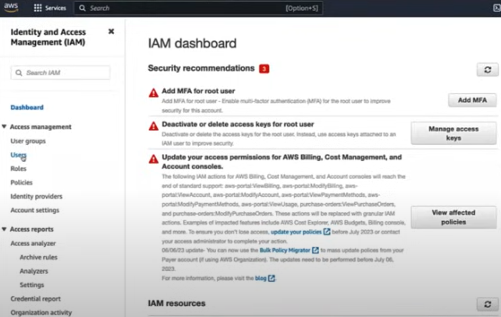
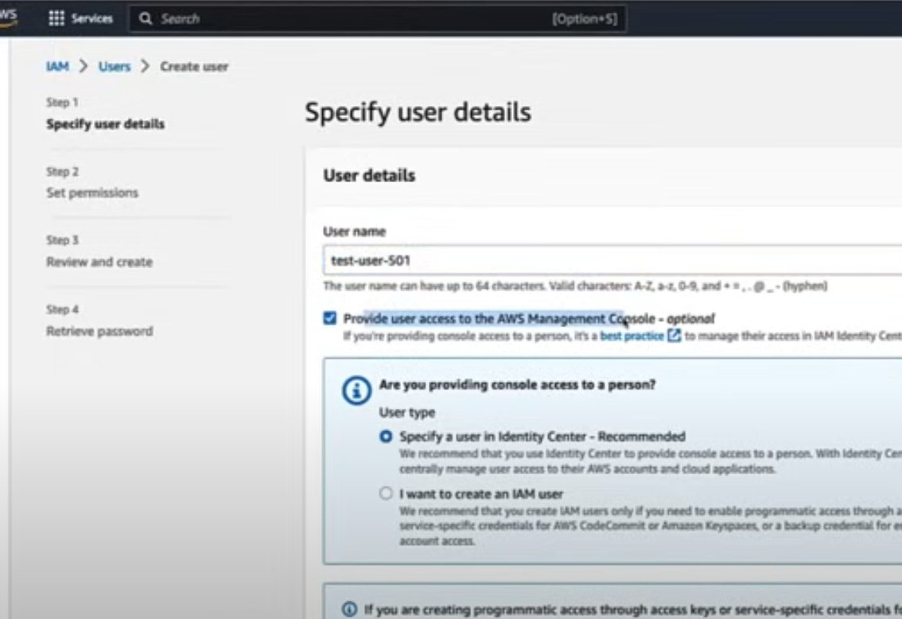
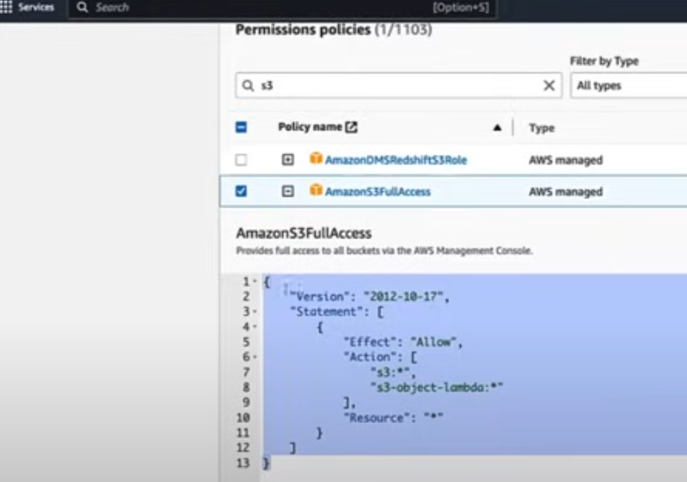
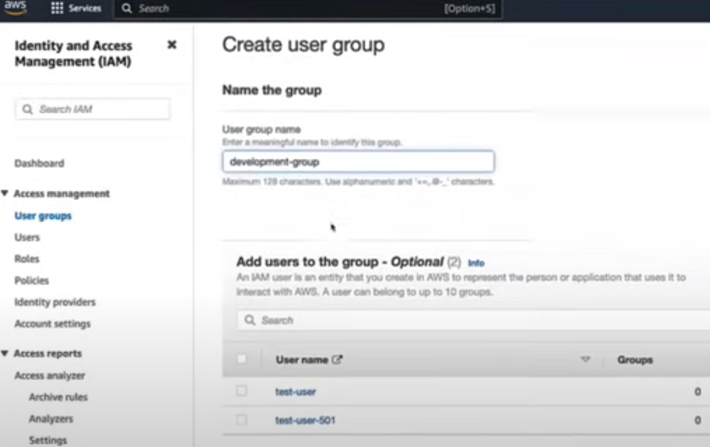
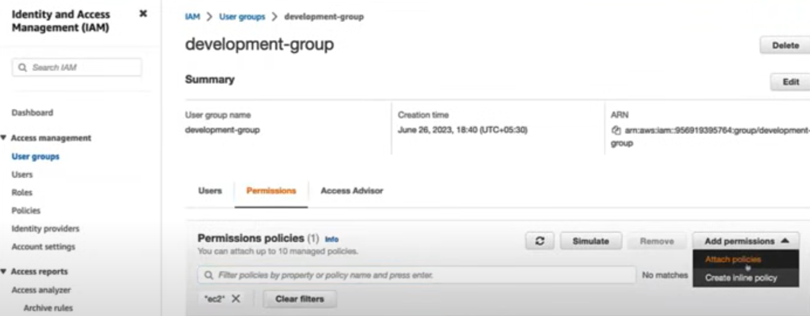
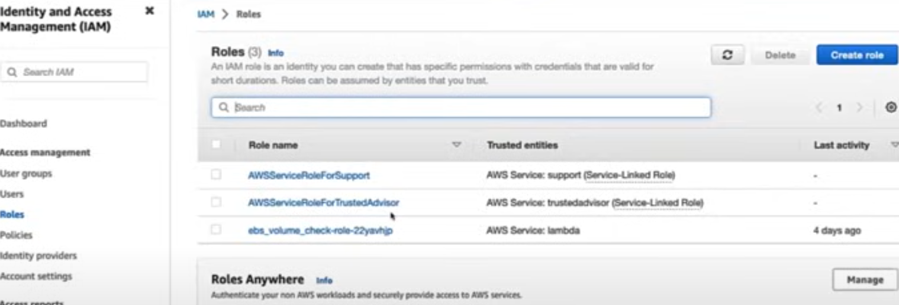

# IAM

**AWS IAM (Identity and Access Management) is a service** provided by Amazon Web Services (AWS) **that helps you manage access to your AWS resources**. It's like a security system for your AWS account.

**IAM allows you to create and manage users, groups, and roles**. **Users represent individual people or entities** who need access to your AWS resources. **Groups are collections of users with similar access requirements**, making it easier to manage permissions. **Roles are used to grant temporary access to external entities or services**.

With IAM, you can **control and define permissions through policies**. Policies are **written in JSON format and specify what actions are allowed or denied on specific AWS resources**. These policies can be attached to IAM entities (users, groups, or roles) to grant or restrict access to AWS services and resources.

**IAM follows the principle of least privilege, meaning users and entities are given only the necessary permissions required for their tasks**, minimizing potential security risks. IAM also provides features like multi-factor authentication (MFA) for added security and an audit trail to track user activity and changes to permissions.

By using AWS IAM, you can effectively manage and secure access to your AWS resources, ensuring that only authorized individuals have appropriate permissions and actions are logged for accountability and compliance purposes.

Overall, IAM is an essential component of AWS security, providing granular control over access to your AWS account and resources, reducing the risk of unauthorized access and helping maintain a secure environment.


---
## Components of IAM 

1. **Users: IAM users represent individual people or entities (such as applications or services) that interact with your AWS resources**. Each user has a **unique name and security credentials (password or access keys)** used for authentication and access control.

2. **Groups: IAM groups are collections of users with "similar" access requirements**. Instead of managing permissions for each user individually, you can **assign permissions to groups, making it easier to manage access control**. Users can be added or removed from groups as needed.

3. **Roles: IAM roles are used to grant "temporary" access to AWS resources**. Roles are typically used by applications or services that need to access AWS resources on behalf of users or other services. **Roles have associated policies that define the permissions and actions allowed for the role**.

4. **Policies: IAM policies are JSON documents that define permissions**. Policies specify the actions that can be performed on AWS resources and the resources to which the actions apply. **Policies can be attached to users, groups, or roles to control access**. IAM provides both AWS **managed policies** (predefined policies maintained by AWS) and **customer managed policies** (policies created and managed by you).


---
**Root User Login**


**IAM Service Dashboard**


**IAM User creation**


**IAM User Login**


**Assign permissions Policies to a User**


**User Group**


**Add Users to a Group**


**Add Permissions to a Group**


**Roles**



---
```text
# Interview Questions

Q: What is AWS IAM, and why is it important?

A: AWS IAM (Identity and Access Management) is a service provided by Amazon Web Services that helps you control access to your AWS resources. It allows you to manage user identities, permissions, and policies. IAM is important because it enhances security by ensuring that only authorized individuals or entities have access to your AWS resources, helping you enforce the principle of least privilege and maintain a secure environment.

Q: What is the difference between IAM users and IAM roles?

A: IAM users represent individual people or entities that need access to your AWS resources. They have their own credentials and are typically associated with long-term access. On the other hand, IAM roles are used to grant temporary access to AWS resources, usually for applications or services. Roles have associated policies and can be assumed by trusted entities to access resources securely.

Q: What are IAM policies, and how do they work?

A: IAM policies are JSON documents that define permissions. They specify what actions are allowed or denied on AWS resources and can be attached to IAM users, groups, or roles. Policies control access by matching the actions requested by a user or entity with the actions allowed or denied in the policy. If a requested action matches an allowed action in the policy, access is granted; otherwise, it is denied.

Q: What is the principle of least privilege, and why is it important in IAM?

A: The principle of least privilege states that users should be granted only the permissions necessary to perform their tasks and nothing more. It is important in IAM because it minimizes the risk of unauthorized access and limits the potential damage that could be caused by a compromised account. Following the principle of least privilege helps maintain a secure environment by ensuring that users have only the permissions they need to perform their job responsibilities.

Q: What is an AWS managed policy?

A: An AWS managed policy is a predefined policy created and managed by AWS. These policies cover common use cases and provide predefined permissions for specific AWS services or actions. AWS managed policies are maintained and updated by AWS, ensuring they stay up to date with new AWS services and features. They can be attached to IAM users, groups, or roles in your AWS account.
```