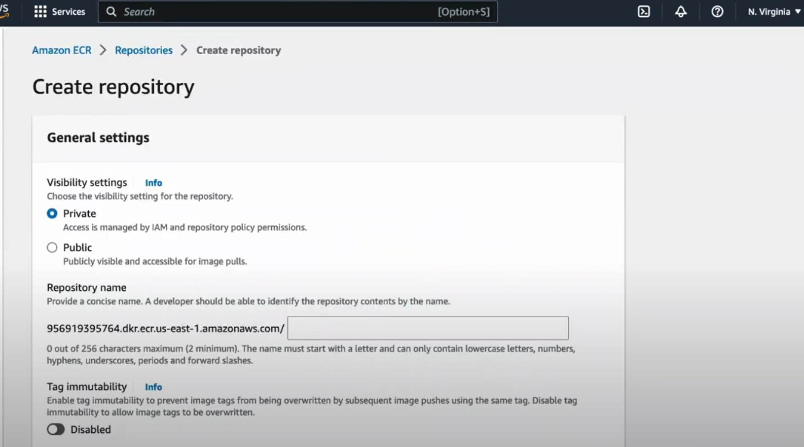
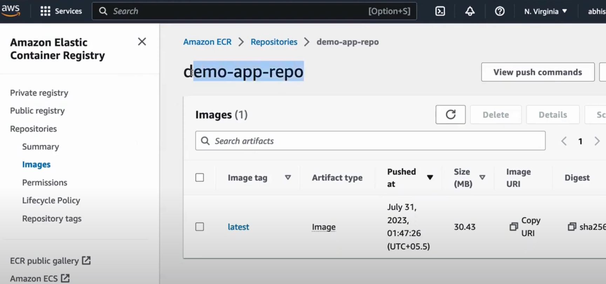

# AWS ECR (Elastic Container Registry)

**Amazon Elastic Container Registry (Amazon ECR) is a fully managed container image registry service provided by AWS. It allows you to store, manage, and deploy Docker container images easily and securely.** ECR integrates seamlessly with AWS services, making it a popular choice for managing containers in AWS environments.

[ECR Guide](https://docs.aws.amazon.com/es_es/AmazonECR/latest/userguide/what-is-ecr.html)

**Key Features of Amazon ECR:**

1. **Fully Managed:**
   ECR is a fully managed service, which means AWS handles all the infrastructure management, scaling, and maintenance. You don’t need to worry about managing your own container registry infrastructure.

2. **Private and Public Repositories:**
   - **Private Repositories:** You can create private repositories for securely storing your own Docker images, controlling access using AWS Identity and Access Management (IAM) policies.
   - **Public Repositories:** ECR also supports public repositories, allowing you to share your container images with the broader community or with specific teams.

3. **High Availability and Scalability:**
   ECR is designed to be highly available and scalable, ensuring that your container images are accessible whenever they are needed, regardless of scale.

4. **Security:**
   - **IAM Integration:** ECR integrates with AWS IAM to control who can access and manage your container images.
   - **Image Encryption:** Images stored in Amazon ECR are encrypted at rest using AWS-managed encryption keys or your own keys.
   - **VPC Integration:** ECR can be used with Amazon Virtual Private Cloud (VPC) to ensure private connectivity and secure access within your AWS environment.
   - **Vulnerability Scanning:** ECR provides image scanning to detect vulnerabilities in your container images using tools like Amazon Inspector.

5. **Seamless Integration with AWS Services:**
   ECR integrates with various AWS services such as:
   - **Amazon Elastic Kubernetes Service (EKS): For deploying containerized applications on Kubernetes.**
   - **Amazon Elastic Container Service (ECS):** For managing containerized applications.
   - **AWS Fargate:** For serverless containers, allowing you to deploy without managing the underlying infrastructure.

6. **Docker CLI Integration:**
   You can interact with ECR using standard Docker CLI commands, making it easy to push, pull, and manage container images.

7. **Lifecycle Policies:**
   ECR supports lifecycle policies, which allow you to define rules for automatically cleaning up old or unused container images, helping you manage storage costs efficiently.

8. **Cross-Region and Cross-Account Replication:**
   You can configure ECR to replicate container images across different AWS regions or even across different AWS accounts, which is helpful for multi-region deployments and ensuring availability.

**How ECR Works:**

1. **Create a Repository:** You start by creating a repository in ECR to store your Docker images.
2. **Push Images:** Use Docker CLI or other tools to push your images to the ECR repository.
3. **Pull Images:** When deploying containers, your services (ECS, EKS, Fargate, etc.) can pull the images from ECR.
4. **Manage Images:** You can set up image lifecycle policies to automatically remove old images, and enable scanning for vulnerabilities.

**Typical Workflow:**

1. **Login to ECR:**  
   You authenticate Docker with ECR using AWS CLI.
   ```bash
   aws ecr get-login-password --region <region> | docker login --username AWS --password-stdin <aws_account_id>.dkr.ecr.<region>.amazonaws.com
   ```

2. **Tag your Docker image:**
   ```bash
   docker tag my-image:latest <aws_account_id>.dkr.ecr.<region>.amazonaws.com/my-repository:latest
   ```

3. **Push your Docker image:**
   ```bash
   docker push <aws_account_id>.dkr.ecr.<region>.amazonaws.com/my-repository:latest
   ```

4. **Pull your Docker image:**  
   Your services (e.g., ECS, EKS, or your local Docker instance) can pull images as needed.
   ```bash
   docker pull <aws_account_id>.dkr.ecr.<region>.amazonaws.com/my-repository:latest
   ```

**Use Cases:**

- **CI/CD Pipelines: ECR is often used in CI/CD workflows to store and manage Docker images that are deployed as part of automated build and deployment processes.**
- **Microservices Deployments: It’s used to manage images for microservices architectures deployed in ECS, EKS**, or Fargate.
- **Hybrid Cloud:** You can use ECR to store images that are used in both AWS and on-premises environments.

***Amazon ECR is a robust service for managing Docker images in AWS, and its tight integration with other AWS services makes it an ideal choice for AWS-centric containerized applications.***

---
**What is AWS ECR?:**

**AWS Elastic Container Registry (ECR) is a fully managed container image registry service provided by Amazon Web Services (AWS). It enables you to store, manage, and deploy container images (Docker images) securely, making it an essential component of your containerized application development workflow. ECR integrates seamlessly with other AWS services like Amazon Elastic Container Service (ECS) and Amazon Elastic Kubernetes Service (EKS).**

**Key Benefits of ECR:**

- **Security**: ECR offers encryption at rest, and images are stored in private repositories by default, ensuring the security of your container images.
- **Integration**: ECR integrates smoothly with AWS services like ECS and EKS, simplifying the deployment process.
- **Scalability**: As a managed service, ECR automatically scales to meet the demands of your container image storage.
- **Availability**: ECR guarantees high availability, reducing the risk of image unavailability during critical times.
- **Lifecycle Policies**: You can define lifecycle policies to automate the cleanup of unused or old container images, helping you save on storage costs.

**Getting Started with AWS ECR:**

**Creating an ECR Repository**

1. Go to the AWS Management Console and navigate to the Amazon ECR service.
2. Click on "Create repository" to create a new repository.
3. Enter a unique name for your repository and click "Create repository."

**Installing AWS CLI**

To interact with ECR from your local machine, you'll need to have the AWS Command Line Interface (CLI) installed. Follow the instructions in the [AWS CLI User Guide](https://docs.aws.amazon.com/cli/latest/userguide/cli-configure-quickstart.html) to install it.

**Configuring AWS CLI**
After installing the AWS CLI, open a terminal and run the following command to configure your CLI with your AWS credentials:

```
aws configure
```

Enter your AWS Access Key ID, Secret Access Key, default region, and preferred output format when prompted.

**Pushing Docker Images to ECR**

Now that you have your ECR repository set up and the AWS CLI configured, let's push a Docker image to ECR.

1. Build your Docker image locally using the `docker build` command:

```
docker build -t <your-image-name> <path-to-dockerfile>
```

2. Tag the image with your ECR repository URI:

```
docker tag <your-image-name>:<tag> <your-aws-account-id>.dkr.ecr.<your-region>.amazonaws.com/<your-repository-name>:<tag>
```

3. Log in to your ECR registry using the AWS CLI:

```
aws ecr get-login-password --region <your-region> | docker login --username AWS --password-stdin <your-aws-account-id>.dkr.ecr.<your-region>.amazonaws.com
```

4. Push the Docker image to ECR:

```
docker push <your-aws-account-id>.dkr.ecr.<your-region>.amazonaws.com/<your-repository-name>:<tag>
```

**Pulling Docker Images from ECR**

To pull and use the Docker images from ECR on another system or AWS service, follow these steps:

1. Log in to ECR using the AWS CLI as shown in Step 3 of the previous section.
2. Pull the Docker image from ECR:

```
docker pull <your-aws-account-id>.dkr.ecr.<your-region>.amazonaws.com/<your-repository-name>:<tag>
```

**Cleaning Up Resources**

As good practice, remember to clean up resources that you no longer need to avoid unnecessary costs. To delete an ECR repository:

1. Make sure there are no images in the repository, or delete the images using `docker rmi` locally.
2. Go to the AWS Management Console, navigate to the Amazon ECR service, and select your repository.
3. Click on "Delete" and confirm the action.


---
**ECR Dashboard - Create Repository for Storing Docker Images:**



**ECR - Demo image pushed into Private Repository:**

