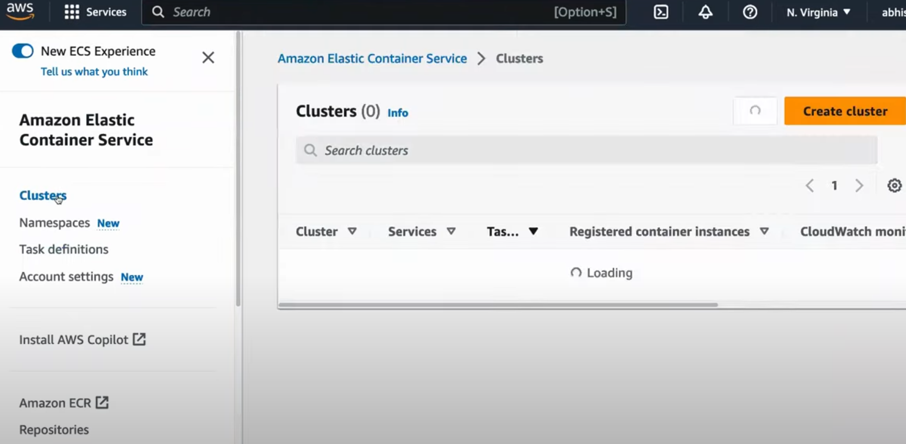
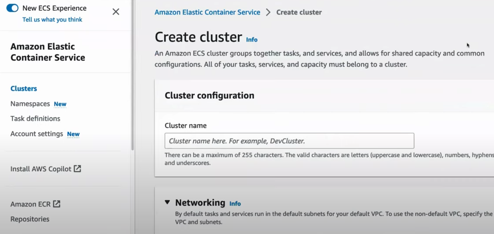
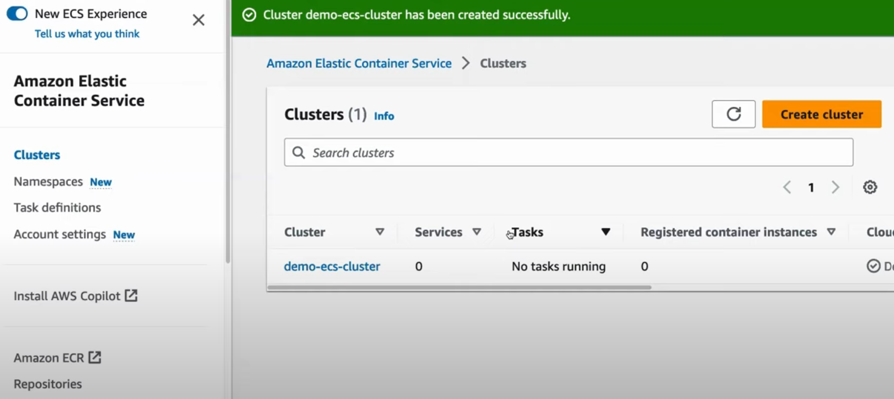
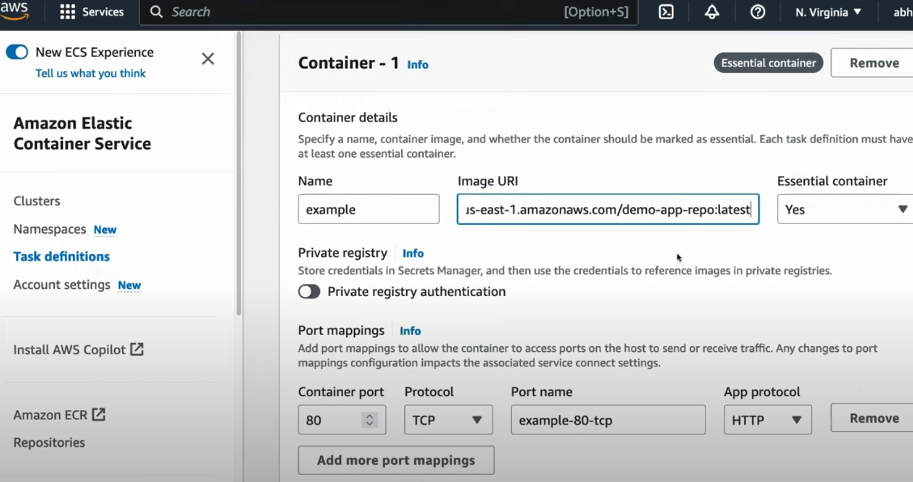
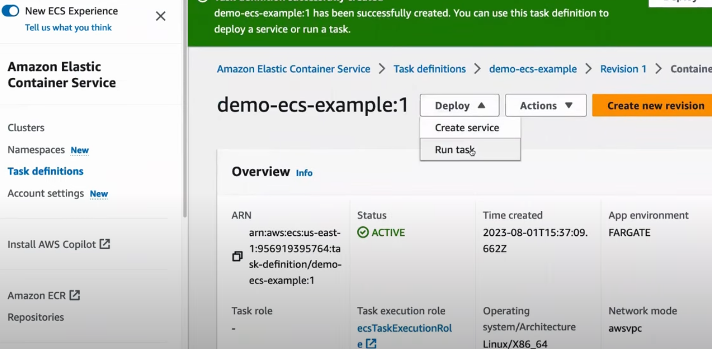

# AWS ECS (Elastic Container Service)

**Amazon Elastic Container Service (Amazon ECS) is a fully managed container orchestration service that enables you to run, scale, and manage Docker containers.** It integrates closely with other AWS services, such as **Amazon EC2** (Elastic Compute Cloud) and **AWS Fargate** (serverless compute engine for containers), to provide a flexible and scalable solution for containerized applications.

**Key Features of Amazon ECS:**

1. **Orchestration and Scheduling:**
   ECS handles the scheduling of containerized applications, managing where and when to run containers on a cluster of virtual machines (EC2 instances) or in a serverless environment (AWS Fargate). It automatically places tasks based on resource requirements, policies, and defined schedules.

2. **Task Definition:**
   A **task definition** in ECS is a blueprint that defines the Docker container specifications, including:
   - Container image to use
   - CPU and memory requirements
   - Networking settings
   - Volumes (data storage)
   - Log configuration
   - IAM roles for permission management

3. **Cluster Management:**
   ECS allows you to manage **clusters** of EC2 instances or Fargate tasks. A cluster is a logical grouping of tasks or services that ECS runs. ECS automatically monitors the cluster's health, scaling resources as needed.

4. **Integration with AWS Services:**
   ECS integrates seamlessly with many AWS services, such as:
   - **Amazon EC2**: For deploying containerized applications on EC2 instances.
   - **AWS Fargate**: For running containers without managing the underlying infrastructure (serverless containers).
   - **Elastic Load Balancing (ELB)**: For distributing traffic across multiple containers.
   - **Amazon CloudWatch**: For monitoring and logging container performance and activities.
   - **Amazon ECR**: For storing and retrieving container images.
   - **AWS Identity and Access Management (IAM)**: For securing access to ECS tasks and services.

5. **AWS Fargate Integration:**
   ECS can run in two modes:
   - **ECS with EC2 Launch Type**: This mode lets you manage the underlying EC2 instances that run the containers. You control the cluster size, instance type, and scaling.
   - **ECS with Fargate Launch Type**: This is a serverless option where AWS Fargate handles provisioning and scaling the infrastructure, allowing you to focus solely on deploying and managing containers.

6. **Service Auto Scaling:**
   ECS integrates with **AWS Auto Scaling**, enabling you to automatically scale your services based on predefined metrics, such as CPU or memory usage. This ensures your applications can handle fluctuations in traffic and workloads without manual intervention.

7. **Service Discovery and Load Balancing:**
   ECS has built-in support for **service discovery**, allowing services to find and communicate with each other easily. It also integrates with **Elastic Load Balancing** (ELB), so you can distribute traffic between containers across multiple instances.

8. **Security:**
   - ECS integrates with **AWS IAM** for role-based access control, enabling fine-grained permissions for containerized applications.
   - ECS tasks can run in **Amazon Virtual Private Cloud (VPC)**, giving you control over network security and isolation.
   - With **ECS Task Roles**, you can assign specific IAM roles to individual ECS tasks, ensuring secure access to AWS resources.

9. **Networking:**
   ECS supports multiple networking modes:
   - **Bridge Mode:** The default Docker bridge network.
   - **Host Mode:** Shares the host's networking namespace.
   - **AWS VPC Mode:** Each task gets its own elastic network interface (ENI) within a VPC, allowing for secure networking and fine-grained control over security groups and IP addresses.

**Key Components of ECS:**

1. **Tasks:**
   A task is the unit of work in ECS. It defines one or more Docker containers running together with specified resource allocations (CPU, memory, etc.).

2. **Services:**
   A service is used to run and maintain a specified number of tasks. It ensures that the desired number of tasks are always running and allows for load balancing between them. You can set up services to automatically replace failed tasks and scale up or down based on demand.

3. **Clusters:**
   A cluster is a logical group of EC2 instances or Fargate tasks on which you deploy your containers. You can run multiple services and tasks within a single cluster.

4. **Task Definition:**
   The task definition is a JSON file that specifies:
   - The Docker image for each container in the task
   - Resources (CPU, memory) required by the containers
   - Environment variables, volumes, and networking settings

**ECS Launch Types:**

1. **EC2 Launch Type:**
   In this mode, you manage the underlying EC2 instances in your ECS cluster. You control the infrastructure, such as choosing the instance type, managing scaling, and maintaining the health of the instances. This is useful if you want more control over the operating system, instance configurations, or need specialized hardware like GPUs.

2. **Fargate Launch Type:**
   This is a serverless option where AWS manages the infrastructure for you. You only need to define the CPU and memory requirements for your tasks, and Fargate automatically provisions the resources. This simplifies container management since you don’t need to manage the underlying EC2 instances or clusters.

**Use Cases for ECS:**

1. **Microservices:**
   ECS is ideal for running microservices-based architectures where different services are isolated into separate containers, providing better scalability and modularity.

2. **CI/CD Pipelines:**
   ECS integrates well with tools like **AWS CodePipeline**, **AWS CodeBuild**, and other CI/CD services to automate the build, test, and deployment of containerized applications.

3. **Hybrid Deployments:**
   ECS allows you to deploy applications in both on-premises and AWS environments, offering flexibility for hybrid cloud deployments.

4. **Batch Processing:**
   ECS can be used for batch processing, running containers that process tasks in parallel and can scale up or down based on demand.

**Typical Workflow with ECS:**

1. **Define a Task:**
   You define a task in ECS by specifying container images, resource requirements (CPU, memory), and environment configurations in a **task definition**.

2. **Deploy a Service:**
   You create a service to ensure the task is running the desired number of instances (tasks). The service can be integrated with an **Elastic Load Balancer** (ELB) to distribute traffic evenly across the tasks.

3. **Auto Scaling and Monitoring:**
   ECS can automatically scale the service based on defined policies (e.g., scaling up when CPU usage exceeds a certain threshold) and integrates with **Amazon CloudWatch** for logging and monitoring container metrics.

**Example ECS Workflow Using AWS Fargate:**

1. **Create a Task Definition:**  
   Define your Docker container requirements, such as image, memory, and environment variables.
   ```bash
   aws ecs register-task-definition --cli-input-json file://task-definition.json
   ```

2. **Create a Cluster:**  
   Create a new ECS cluster to run your tasks.
   ```bash
   aws ecs create-cluster --cluster-name my-cluster
   ```

3. **Run a Task:**  
   Start a task in Fargate using your task definition.
   ```bash
   aws ecs run-task --cluster my-cluster --launch-type FARGATE --task-definition my-task
   ```

4. **Monitor the Service:**  
   Use **CloudWatch** and **ECS Console** to monitor the health, logs, and scaling of your containers.

**Benefits of Using ECS:**
- **Seamless AWS Integration:** Deep integration with AWS services like EC2, Fargate, CloudWatch, IAM, and ECR.
- **Flexibility:** Ability to choose between EC2 for more control or Fargate for serverless, simplified management.
- **Cost-Efficiency:** Only pay for the resources you use. You can optimize costs by choosing the right instance types or using Fargate for on-demand workloads.
- **Security:** Fine-grained access control through IAM, secure networking via VPC, and ECS task roles for secure access to AWS resources.

***In summary, Amazon ECS provides a powerful and flexible platform for running containerized applications, with support for both managed infrastructure (Fargate) and user-managed EC2 clusters. Its tight integration with AWS services makes it an excellent choice for deploying containers in AWS environments.***


---
# AWS ECS Deep Dive

## Introduction

In the ever-evolving world of cloud computing, containerization has emerged as a pivotal technology, enabling developers to package their applications along with all dependencies into a single, portable unit. **Amazon Elastic Container Service (ECS), a fully managed container orchestration service from AWS, simplifies the deployment, management, and scaling of containerized applications.**

This blog post aims to be your ultimate guide to AWS ECS. We'll start from the fundamentals and gradually delve into the comparisons with its alternatives. We'll also discuss the pros and cons of ECS, provide step-by-step instructions for installation and configuration, and finally, guide you through deploying your first application on ECS.

**1. What is AWS ECS?**

**AWS ECS is a fully managed container orchestration service that allows you to run Docker containers at scale.** It eliminates the need to manage your own container orchestration infrastructure and provides a highly scalable, reliable, and secure environment for deploying and managing your applications.

**2. Why Choose ECS Over Other Container Orchestration Tools**

Before diving deep into ECS, let's compare it with some popular alternatives like Kubernetes and Docker Swarm.

**Comparison with Kubernetes:**

**Kubernetes is undoubtedly a powerful container orchestration tool with a vast ecosystem, but it comes with a steeper learning curve. ECS, on the other hand, offers a more straightforward setup and is tightly integrated with other AWS services, making it a preferred choice for AWS-centric environments.**

**Comparison with Docker Swarm:**

Docker Swarm is relatively easy to set up and is suitable for small to medium-scale deployments. However, as your application grows, ECS outshines Docker Swarm in terms of scalability, reliability, and seamless integration with AWS features like IAM roles and CloudWatch.

**3. ECS Fundamentals**

To understand ECS better, let's explore its core components:

**Clusters:**

**A cluster is a logical grouping of EC2 instances or Fargate tasks on which you run your containers.** It acts as the foundation of ECS, where you can deploy your services.

**Task Definitions:**

**Task Definitions define how your containers should run, including the Docker image to use, CPU and memory requirements, networking, and more. It is like a blueprint for your containers.**

**Tasks:**

**A task represents a single running instance of a task definition within a cluster. It could be a single container or multiple related containers that need to work together.**

**Services:**

**Services help you maintain a specified number of running tasks simultaneously**, ensuring high availability and load balancing for your applications.

**4. Pros of Using AWS ECS:**

- **Fully Managed Service**: AWS handles the underlying infrastructure, making it easier for you to focus on deploying and managing applications.

- **Seamless Integration**: ECS seamlessly integrates with other AWS services like IAM, CloudWatch, Load Balancers, and more.

- **Scalability**: With support for Auto Scaling, ECS can automatically adjust the number of tasks based on demand.

- **Cost-Effective**: You pay only for the AWS resources you use, and you can take advantage of cost optimization features.

**5. Cons of Using AWS ECS:**

- **AWS-Centric**: If you have a multi-cloud strategy or already invested heavily in another cloud provider, ECS's tight integration with AWS might be a limitation.

- **Learning Curve for Advanced Features**: While basic usage is easy, utilizing more advanced features might require a deeper understanding.

- **Limited Flexibility**: Although ECS can run non-Docker workloads with EC2 launch types, it is primarily optimized for Docker containers.

**6. Installation and Configuration:**

Let's get our hands dirty and set up AWS ECS step-by-step.

**Prerequisites:**

- An AWS account with appropriate IAM permissions.
- The AWS CLI and ECS CLI installed on your local machine.

**Setting Up ECS CLI:**

ECS CLI is a command-line tool that simplifies the process of creating and managing ECS resources.

```bash
$ ecs-cli configure --region <region> --access-key <access-key> --secret-key <secret-key> --cluster <cluster-name>
```

**Configuring AWS Credentials:**

Ensure you have the necessary AWS credentials configured using `aws configure` command.

**7. Deploying Your First Application on ECS**

In this section, we'll deploy a simple web application using ECS.

**Preparing the Application:**

1. Create a Dockerfile for your web application.
2. Build the Docker image and push it to Amazon ECR (Elastic Container Registry).

**Creating a Task Definition:**

Define the task using the ECS CLI or the AWS Management Console.

**Configuring the Service:**

Create an ECS service to manage the desired number of tasks and set up load balancing.

**Deploying the Service:**

Use the ECS CLI or the AWS Management Console to deploy the service.

**Monitoring the Service:**

Monitor your ECS service using AWS CloudWatch metrics and logs.

**8. Conclusion:**

In conclusion, AWS ECS offers a robust and user-friendly platform for deploying and managing containerized applications. We covered the fundamentals of ECS, compared it with its alternatives, discussed its pros and cons, and walked through the installation, configuration, and deployment of a sample application.


---
**ECS Dashboard:**



**ECS - Create Cluster:**



**ECS - Cluster Created:**



**ECS - Create New Task Definition for Running ECR/Docker image in Cluster:**



**ECS - Run Task/Manifest Defined in Cluster:**

