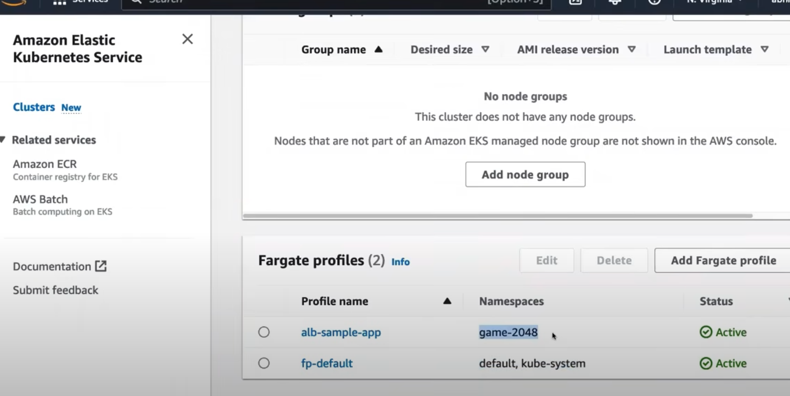

# AWS EKS 

**Amazon Elastic Kubernetes Service (Amazon EKS) is a managed Kubernetes service provided by AWS, designed to run, scale, and manage Kubernetes applications on the AWS cloud.** EKS simplifies the process of running Kubernetes clusters by managing the Kubernetes control plane, automating tasks such as scaling, patching, and securing the cluster.

**Key Features of Amazon EKS:**

1. **Managed Kubernetes Control Plane:**
   **AWS EKS runs and scales the Kubernetes control plane across multiple Availability Zones to ensure high availability.** AWS manages key components like the API server, etcd database, and other core services, providing a managed experience for users without the need to manually set up and manage Kubernetes control plane components.

2. **Integration with AWS Services:**
   EKS integrates seamlessly with various AWS services, enhancing your Kubernetes environment:
   - **Amazon EC2** for running worker nodes
   - **AWS Fargate** for running serverless pods
   - **Amazon ECR (Elastic Container Registry)** for storing container images
   - **Elastic Load Balancer (ELB)** for traffic distribution
   - **AWS IAM** for controlling access and permissions
   - **Amazon VPC** for secure and isolated networking

3. **Highly Available and Secure:**
   - **Multi-AZ Control Plane:** The EKS control plane runs across multiple AWS availability zones to ensure high availability. 
   - **Security Integration:** EKS integrates with **AWS Identity and Access Management (IAM)** to control access to Kubernetes resources. It also supports network policies, security groups, and encryption options for safeguarding your applications.
   - **Auto-Scaling and Self-Healing:** EKS integrates with **Cluster Autoscaler** to dynamically adjust the number of worker nodes based on resource usage. Kubernetes automatically replaces unhealthy nodes or failed pods.

4. **Kubernetes API Compatibility:**
   EKS is fully compatible with upstream Kubernetes, meaning you can use standard Kubernetes tooling and APIs (kubectl, Helm, etc.) with EKS. This makes it easy to migrate applications from on-premises or other Kubernetes environments to AWS.

5. **AWS Fargate Integration:**
   **EKS supports AWS Fargate (Serverless), allowing you to run Kubernetes pods without managing the underlying infrastructure.** Fargate automatically provisions and scales the compute resources required to run containers.

6. **Managed Node Groups:**
   **EKS allows you to create and manage "node groups" (groups of EC2 instances that serve as worker nodes for your cluster) through a managed experience.** AWS handles node updates and terminations for you.

7. **Kubernetes Networking:**
   - **Amazon VPC CNI Plugin:** EKS provides the **Amazon VPC Container Networking Interface (CNI)** plugin, which integrates Kubernetes networking with the Amazon VPC, enabling each pod to receive its own IP address.
   - **Load Balancing:** EKS integrates with **AWS Elastic Load Balancer** to automatically distribute traffic between services running on different pods.

8. **EKS Add-ons:**
   EKS supports installing Kubernetes add-ons, such as:
   - **CoreDNS** for DNS-based service discovery.
   - **kube-proxy** for networking.
   - **Amazon VPC CNI** for VPC integration.
   These add-ons can be managed by EKS, so you don’t need to install or manage them manually.

9. **Monitoring and Logging:**
   EKS integrates with **Amazon CloudWatch** for monitoring and logging Kubernetes clusters. You can set up CloudWatch metrics and alarms for your cluster and use **AWS CloudTrail** to track API calls made by Kubernetes and AWS resources.

10. **Version Control and Updates:**
    EKS allows you to choose the Kubernetes version that fits your needs and provides regular updates to ensure you're running the latest and most secure versions of Kubernetes. You can perform in-place upgrades of the control plane and worker nodes without downtime.

**Key Components of EKS:**

1. **Control Plane:**
   **The control plane is fully managed by AWS, meaning you don’t have to handle its setup, patching, or scalability. It runs Kubernetes components like the API server and the etcd database.**

2. **Worker Nodes:**
   **Worker nodes are EC2 instances or Fargate pods that run your containerized workloads.** Worker nodes communicate with the managed control plane, and you can run workloads on one or more nodes in a cluster.

3. **Cluster Autoscaler:**
   EKS supports the **Kubernetes Cluster Autoscaler**, which automatically adjusts the size of your worker node pool based on resource demands. If pods can’t be scheduled due to insufficient resources, the autoscaler increases the number of nodes.

4. **Networking:**
   EKS integrates with your Amazon VPC, and each pod gets its own IP address. **You can control inbound and outbound traffic using VPC security groups and use network policies to secure communication between pods.**

**Deployment Models:**

1. **EKS with EC2:**
   In this model, you run your Kubernetes worker nodes on **Amazon EC2** instances. **You manage the EC2 infrastructure**, including selecting instance types, scaling policies, and networking.

2. **EKS with Fargate:**
   This is a **serverless option where AWS Fargate runs your Kubernetes pods without you having to manage the underlying compute infrastructure.** It automatically provisions the necessary compute resources for your pods.

3. **Hybrid Deployments:**
   You can also run EKS clusters across on-premises data centers and the cloud using **AWS Outposts** or other Kubernetes hybrid models, enabling consistent operations between your on-premises and cloud-based workloads.

**How to Set Up EKS:**

1. **Create an EKS Cluster:**
   You can create an EKS cluster via the AWS Management Console, AWS CLI, or Infrastructure-as-Code tools like Terraform or AWS CloudFormation.

   Example using the AWS CLI:
   ```bash
   aws eks create-cluster --name my-cluster --role-arn <iam_role_arn> --resources-vpc-config subnetIds=<subnet_ids>,securityGroupIds=<sg_ids>
   ```

2. **Provision Worker Nodes:**
   **Once your control plane is ready, you can add worker nodes (either EC2 instances or Fargate tasks) to the cluster.** 

   For EC2 instances, AWS provides an Amazon Machine Image (AMI) optimized for EKS:
   ```bash
   aws eks create-nodegroup --cluster-name my-cluster --nodegroup-name my-nodes --node-role <node_role_arn> --subnets <subnet_ids>
   ```

3. **Configure `kubectl`:**
   Install and configure **kubectl** to interact with your EKS cluster.
   ```bash
   aws eks update-kubeconfig --region <region> --name my-cluster
   ```

4. **Deploy Applications:**
   Once your cluster is up, you can deploy Kubernetes applications using standard tools like **kubectl** or **Helm** charts.
   ```bash
   kubectl apply -f deployment.yaml
   ```

5. **Monitor and Scale:**
   Use **Amazon CloudWatch** to monitor your cluster and automatically scale pods or worker nodes as needed using **Horizontal Pod Autoscaler** or **Cluster Autoscaler**.

**Use Cases for EKS:**

1. **Microservices:**
   EKS is ideal for managing microservices architectures, where different services are deployed as Kubernetes pods, enabling scalability, resilience, and independent updates.

2. **Hybrid Cloud:**
   With support for both on-premises and cloud deployments, EKS is well-suited for hybrid cloud scenarios, where workloads are distributed across environments.

3. **Continuous Deployment:**
   EKS integrates well with CI/CD pipelines, enabling automated deployment of containerized applications. Tools like **Jenkins**, **CodePipeline**, and **CodeBuild** can be used to automate testing, building, and deploying applications to an EKS cluster.

4. **Machine Learning Workloads:**
   EKS integrates with **Kubeflow** and other tools to support machine learning workloads. Kubernetes provides a scalable and flexible environment for training and deploying machine learning models.

**Benefits of EKS:**

1. **Simplified Kubernetes Management:**
   EKS manages the Kubernetes control plane, reducing operational overhead.
   
2. **Security and Compliance:**
   EKS integrates with AWS’s robust security services, including IAM, VPC, and security groups, ensuring secure access to your clusters.

3. **Scalability:**
   EKS supports automatic scaling for both the control plane and worker nodes, ensuring your applications can handle varying workloads.

4. **Cost-Effective:**
   With options to run workloads on EC2 or Fargate, you can optimize costs based on your application's needs—choosing the level of control and flexibility you want.

In summary, Amazon EKS simplifies Kubernetes operations by managing the control plane and automating many aspects of the Kubernetes lifecycle. Whether using EC2 for full control or Fargate for serverless deployments, EKS provides a highly scalable, secure, and resilient Kubernetes platform for containerized workloads.


---
# AWS EKS

## 1. Understanding Kubernetes Fundamentals:

**1.1 EKS vs. Self-Managed Kubernetes: Pros and Cons:**

**Pros:**

- Managed Control Plane: EKS takes care of managing the Kubernetes control plane components, such as the API server, controller manager, and etcd. AWS handles upgrades, patches, and ensures high availability of the control plane.

- Automated Updates: EKS automatically updates the Kubernetes version, eliminating the need for manual intervention and ensuring that the cluster stays up-to-date with the latest features and security patches.

- Scalability: EKS can automatically scale the Kubernetes control plane based on demand, ensuring the cluster remains responsive as the workload increases.

- AWS Integration: EKS seamlessly integrates with various AWS services, such as AWS IAM for authentication and authorization, Amazon VPC for networking, and AWS Load Balancers for service exposure.

- Security and Compliance: EKS is designed to meet various security standards and compliance requirements, providing a secure and compliant environment for running containerized workloads.

- Monitoring and Logging: EKS integrates with AWS CloudWatch for monitoring cluster health and performance metrics, making it easier to track and troubleshoot issues.

- Ecosystem and Community: Being a managed service, EKS benefits from continuous improvement, support, and contributions from the broader Kubernetes community.

**Cons:**

- Cost: EKS is a managed service, and this convenience comes at a cost. Running an EKS cluster may be more expensive compared to self-managed Kubernetes, especially for large-scale deployments.

- Less Control: While EKS provides a great deal of automation, it also means that you have less control over the underlying infrastructure and some Kubernetes configurations.

**1.1.2 Self-Managed Kubernetes on EC2 Instances:**

**Pros:**

- Cost-Effective: Self-managed Kubernetes allows you to take advantage of EC2 spot instances and reserved instances, potentially reducing the overall cost of running Kubernetes clusters.

- Flexibility: With self-managed Kubernetes, you have full control over the cluster's configuration and infrastructure, enabling customization and optimization for specific use cases.

- EKS-Compatible: Self-managed Kubernetes on AWS can still leverage various AWS services and features, enabling integration with existing AWS resources.

- Experimental Features: Self-managed Kubernetes allows you to experiment with the latest Kubernetes features and versions before they are officially supported by EKS.

**Cons:**

- Complexity: Setting up and managing a self-managed Kubernetes cluster can be complex and time-consuming, especially for those new to Kubernetes or AWS.

- Maintenance Overhead: Self-managed clusters require manual management of Kubernetes control plane updates, patches, and high availability.

- Scaling Challenges: Scaling the control plane of a self-managed cluster can be challenging, and it requires careful planning to ensure high availability during scaling events.

- Security and Compliance: Self-managed clusters may require additional effort to implement best practices for security and compliance compared to EKS, which comes with some built-in security features.

- Lack of Automation: Self-managed Kubernetes requires more manual intervention and scripting for certain operations, which can increase the risk of human error.

## 2. Setting up your AWS Environment for EKS

**2.1 Creating an AWS Account and Setting up IAM Users:**

Creating an AWS account is the first step to access and utilize AWS services, including Amazon Elastic Kubernetes Service (EKS). Here's a step-by-step guide to creating an AWS account and setting up IAM users:

1. **Create an AWS Account**:
   - Go to the AWS website (https://aws.amazon.com/) and click on the "Create an AWS Account" button.
   - Follow the on-screen instructions to provide your email address, password, and required account details.
   - Enter your payment information to verify your identity and set up billing.

2. **Access AWS Management Console**:
   - After creating the account, you will receive a verification email. Follow the link in the email to verify your account.
   - Log in to the AWS Management Console using your email address and password.

3. **Set up Multi-Factor Authentication (MFA)** (Optional but recommended):
   - Once you are logged in, set up MFA to add an extra layer of security to your AWS account. You can use MFA with a virtual MFA device or a hardware MFA device.

4. **Create IAM Users**:
   - Go to the IAM (Identity and Access Management) service in the AWS Management Console.
   - Click on "Users" in the left-hand navigation pane and then click on "Add user."
   - Enter a username for the new IAM user and select the access type (Programmatic access, AWS Management Console access, or both).
   - Choose the permissions for the IAM user by adding them to one or more IAM groups or attaching policies directly.
   - Optionally, set permissions boundary, tags, and enable MFA for the IAM user.

5. **Access Keys (for Programmatic Access)**:
   - If you selected "Programmatic access" during user creation, you will receive access keys (Access Key ID and Secret Access Key).
   - Store these access keys securely, as they will be used to authenticate API requests made to AWS services.

**2.2 Configuring the AWS CLI and `kubectl`:**

With IAM users set up, you can now configure the AWS CLI and kubectl on your local machine to interact with AWS services and EKS clusters:

1. **Installing the AWS CLI**:
   - Download and install the AWS CLI on your local machine. You can find installation instructions for various operating systems [here](https://docs.aws.amazon.com/cli/latest/userguide/cli-configure-quickstart.html).

2. **Configuring AWS CLI Credentials**:
   - Open a terminal or command prompt and run the following command:
     ```
     aws configure
     ```
   - Enter the access key ID and secret access key of the IAM user you created earlier.
   - Choose a default region and output format for AWS CLI commands.

3. **Installing kubectl**:
   - Install kubectl on your local machine. Instructions can be found [here](https://kubernetes.io/docs/tasks/tools/install-kubectl/).

4. **Configuring kubectl for EKS**:
   - Once kubectl is installed, you need to configure it to work with your EKS cluster.
   - In the AWS Management Console, go to the EKS service and select your cluster.
   - Click on the "Config" button and follow the instructions to update your kubeconfig file. Alternatively, you can use the AWS CLI to update the kubeconfig file:
     ```
     aws eks update-kubeconfig --name your-cluster-name
     ```
   - Verify the configuration by running a kubectl command against your EKS cluster:
     ```
     kubectl get nodes
     ```

**2.3 Preparing Networking and Security Groups for EKS:**

Before launching an EKS cluster, you need to prepare the networking and security groups to ensure proper communication and security within the cluster:

**I. Creating an Amazon VPC (Virtual Private Cloud)**:
   - Go to the AWS Management Console and navigate to the VPC service.
   - Click on "Create VPC" and enter the necessary details like VPC name, IPv4 CIDR block, and subnets.
   - Create public and private subnets to distribute resources in different availability zones.

Sure! Let's go into detail for each of the points:

**II. Configuring Security Groups**

**Security Groups** are a fundamental aspect of Amazon Web Services (AWS) that act as virtual firewalls for your AWS resources, including Amazon Elastic Kubernetes Service (EKS) clusters. Security Groups control inbound and outbound traffic to and from these resources based on rules you define. Here's a step-by-step guide on configuring Security Groups for your EKS cluster:

1. **Create a Security Group**:
   - Go to the AWS Management Console and navigate to the Amazon VPC service.
   - Click on "Security Groups" in the left-hand navigation pane.
   - Click on "Create Security Group."
   - Provide a name and description for the Security Group.
   - Select the appropriate VPC for the Security Group.

2. **Inbound Rules**:
   - Define inbound rules to control incoming traffic to your EKS worker nodes.
   - By default, all inbound traffic is denied unless you explicitly allow it.
   - Common inbound rules include allowing SSH (port 22) access for administrative purposes and allowing ingress traffic from specific CIDR blocks or Security Groups.

3. **Outbound Rules**:
   - Define outbound rules to control the traffic leaving your EKS worker nodes.
   - By default, all outbound traffic is allowed unless you explicitly deny it.
   - For security purposes, you can restrict outbound traffic to specific destinations or ports.

4. **Security Group IDs**:
   - After creating the Security Group, you'll receive a Security Group ID. This ID will be used when launching your EKS worker nodes.

5. **Attach Security Group to EKS Worker Nodes**:
   - When launching the EKS worker nodes, specify the Security Group ID in the launch configuration. This associates the Security Group with the worker nodes, allowing them to communicate based on the defined rules.

Configuring Security Groups ensures that only the necessary traffic is allowed to and from your EKS worker nodes, enhancing the security of your EKS cluster.

**III. Setting Up Internet Gateway (IGW)**

An **Internet Gateway (IGW)** is a horizontally scaled, redundant, and highly available AWS resource that allows communication between your VPC and the internet. To **enable EKS worker nodes to access the internet for tasks like pulling container images, you need to set up an Internet Gateway in your VPC**. Here's how to do it:

1. **Create an Internet Gateway**:
   - Go to the AWS Management Console and navigate to the Amazon VPC service.
   - Click on "Internet Gateways" in the left-hand navigation pane.
   - Click on "Create Internet Gateway."
   - Provide a name for the Internet Gateway and click "Create Internet Gateway."

2. **Attach Internet Gateway to VPC**:
   - After creating the Internet Gateway, select the Internet Gateway in the list and click on "Attach to VPC."
   - Choose the VPC to which you want to attach the Internet Gateway and click "Attach."

3. **Update Route Tables**:
   - Go to "Route Tables" in the Amazon VPC service.
   - Identify the Route Table associated with the private subnets where your EKS worker nodes will be deployed.
   - Edit the Route Table and add a route with the destination `0.0.0.0/0` (all traffic) and the Internet Gateway ID as the target.

By setting up an Internet Gateway and updating the Route Tables, you provide internet access to your EKS worker nodes, enabling them to interact with external resources like container registries and external services.

**IV. Configuring IAM Policies**

**Identity and Access Management (IAM)** is a service in AWS that allows you to manage access to AWS resources securely. IAM policies define permissions that specify what actions are allowed or denied on specific AWS resources. For your EKS cluster, you'll need to configure IAM policies to grant necessary permissions to your worker nodes and other resources. Here's how to do it:

1. **Create a Custom IAM Policy**:
   - Go to the AWS Management Console and navigate to the IAM service.
   - Click on "Policies" in the left-hand navigation pane.
   - Click on "Create policy."
   - Choose "JSON" as the policy language and define the permissions required for your EKS cluster. For example, you might need permissions for EC2 instances, Auto Scaling, Elastic Load Balancing, and accessing ECR (Elastic Container Registry).

2. **Attach the IAM Policy to IAM Roles**:
   - Go to "Roles" in the IAM service and select the IAM role that your EKS worker nodes will assume.
   - Click on "Attach policies" and search for the custom IAM policy you created in the previous step.
   - Attach the policy to the IAM role.

3. **Update EKS Worker Node Launch Configuration**:
   - When launching your EKS worker nodes, specify the IAM role ARN (Amazon Resource Name) of the IAM role that includes the necessary IAM policy.
   - The IAM role allows the worker nodes to authenticate with the EKS cluster and access AWS resources based on the permissions defined in the attached IAM policy.

By configuring IAM policies and associating them with IAM roles, you grant specific permissions to your EKS worker nodes, ensuring they can interact with AWS resources as needed while maintaining security and access control.

By completing these steps, your AWS environment is ready to host an Amazon EKS cluster. You can proceed with creating an EKS cluster using the AWS Management Console or AWS CLI as described in section 3.


---
# Demo Steps

[0 - Prerequisites](./0_prerequisites.md)

[1 - Create EKS Cluster](./1_installing-eks.md)

[2 - Configure Open ID Connect Provider for IAM](./2_configure-oidc-connector.md)

[3 - Create Fargate Profile and Deploy Ingress Controller Implementation](./3_2048-app-deploy-ingress.md)

**New Fargate Profile with New K8s Namespace:**



[4 - Install sample App using `Kubectl` in new "namespace", it requires updating the K8s manifest](./4_sample-app.md)

[5 - ALB Add On and Deploy ALB Ingress Controller Implementation to access from Outside/External IP](./5_alb-controller-add-on.md)

