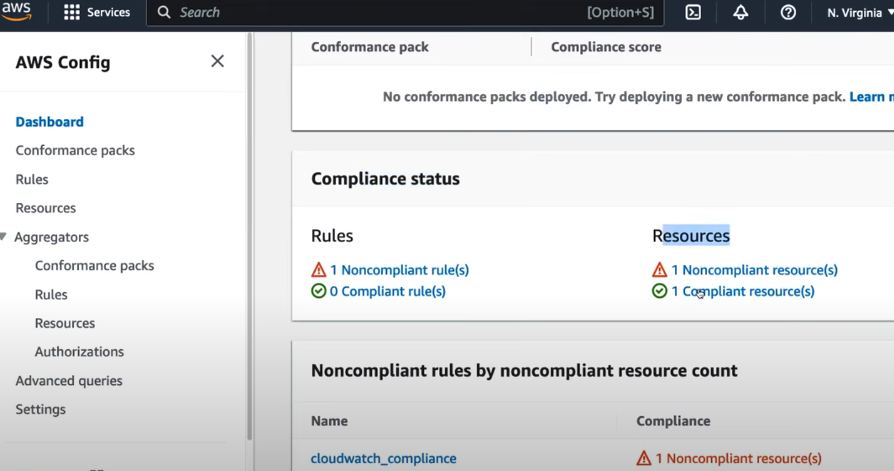

# AWS CloudTrail and AWS Config

**AWS CloudTrail and AWS Config are two essential AWS services used to track and manage the security, compliance, and governance of your AWS resources. Although they both provide visibility into the state and activity of AWS resources, they serve different purposes.**

---
### **AWS CloudTrail**

**AWS CloudTrail** is a service that **monitors and records account activity** across your AWS infrastructure, providing event logs for all actions taken within an AWS account. This includes actions taken by users, roles, services, and APIs. CloudTrail focuses on **auditing** and **security monitoring** by providing a log of all AWS API calls.

**Key Features:**

- **Logs API Activity: CloudTrail captures API calls made via the AWS Management Console, SDKs, command-line tools, and other AWS services.**
- **Event History:** You can access the event history of your account to see recent actions.
- **Governance and Compliance: Provides a history of account activity to help with security audits and compliance requirements.**
- **Multi-Region Tracking:** CloudTrail can be configured to log events from all regions into a single trail.
- **Integration with AWS Services:** CloudTrail integrates with other AWS services like CloudWatch, Lambda, and S3 for advanced monitoring, alerting, and automation.

**Common Use Cases:**

- **Security Auditing: Identify who made changes to AWS resources and track potential security issues.**
- **Compliance Auditing: Maintain records for compliance with security standards like SOC 2, GDPR, and HIPAA.**
- **Troubleshooting:** Investigate operational issues by analyzing detailed logs of AWS resource interactions.
- **Detect Suspicious Activity:** Identify unusual behavior or unauthorized access by analyzing CloudTrail logs.

**CloudTrail Components:**

1. **Event: Every action in CloudTrail creates an event**, which contains the **time**, **user**, **resource** affected, and the **API call** made.
2. **Trail: A trail is the configuration that enables CloudTrail to deliver log files to an S3 bucket, CloudWatch Logs, or CloudWatch Events.**
3. **Event Types:**
   - **Management Events:** Track control plane operations like creating, deleting, or modifying AWS resources.
   - **Data Events:** Track specific operations on S3 objects or Lambda function invocations (these events are not logged by default and must be configured).

***Example Use Case with CloudTrail:***

- **Monitor Root Account Usage:** Set up CloudTrail to alert when the root account is used to log in or perform operations, as this account has full access to all resources.

---
### **AWS Config**

**AWS Config** is a service that **monitors and evaluates the configurations** of your AWS resources over time. It provides detailed information about the state of your AWS resources (such as **EC2 instances**, **S3 buckets**, **security groups**, etc.) and tracks how the configurations change over time.

**Key Features:**

- **Configuration History: AWS Config captures and stores the configuration history of AWS resources, showing how resource properties change over time.**
- **Configuration Snapshots: AWS Config can take "point-in-time snapshots" of your resource configurations.**
- **Resource Relationships:** Tracks relationships between AWS resources (e.g., an EC2 instance associated with a security group).
- **Compliance Monitoring:** AWS Config evaluates resources against predefined or custom **config rules** to ensure they comply with organizational policies.
- **Drift Detection: Detects and reports on configuration "drift", meaning when resources deviate from their expected configurations.**
- **Automation:** Can trigger AWS Config rules to automatically remediate non-compliant resources.

**Common Use Cases:**

- **Compliance Auditing:** AWS Config helps verify if resources meet security and compliance standards. **You can set up AWS Config rules to evaluate compliance with PCI-DSS, HIPAA, GDPR, and other standards.**
- **Resource Inventory:** Maintain an inventory of all AWS resources, including metadata, configuration settings, and relationships between resources.
- **Operational Troubleshooting:** Analyze changes to resource configurations that may have caused service disruptions.
- **Change Management:** Track and document configuration changes for audit purposes.

**AWS Config Components:**

1. **Configuration Item:** A record that contains the configuration of an AWS resource at any given point in time.
2. **Config Rules:** These are AWS-managed or custom rules that define the desired configuration state of resources. AWS Config continuously checks whether resources comply with these rules.
3. **Compliance Status:** AWS Config tracks whether a resource is **compliant** or **non-compliant** with a rule.

***Example Use Case with AWS Config:***

- **Ensuring S3 Bucket Encryption:** You can create a Config rule to ensure that all S3 buckets have server-side encryption enabled. If a bucket is non-compliant, AWS Config can trigger a remediation action (e.g., enabling encryption).

---
### **Differences Between AWS CloudTrail and AWS Config**

| Feature               | **AWS CloudTrail**                                   | **AWS Config**                                      |
|-----------------------|------------------------------------------------------|----------------------------------------------------|
| **Purpose**            | Track **API calls** and events for auditing and security | Track **configuration changes** and compliance     |
| **Scope**              | Focuses on **who** did **what** and **when**         | Focuses on **what** resources are and **how** they're configured |
| **Data Collected**     | API call history, including source IP and user info  | Configuration snapshots, relationships, and changes |
| **Compliance**         | Useful for investigating security breaches           | Ensures that resources comply with **predefined rules** |
| **Event History**      | Tracks API actions performed on AWS services         | Provides point-in-time snapshots of configurations  |
| **Change Detection**   | Detects **user activity** changes (API calls)        | Detects **configuration drift** and non-compliant resources |
| **Integration**        | Works well with CloudWatch, Lambda for alerts        | Integrates with AWS Systems Manager for automation and remediation |

---

### **When to Use AWS CloudTrail vs. AWS Config?**

- **Use AWS CloudTrail when you want to:**
  - Track user activity and API calls.
  - Understand who made changes to resources.
  - Audit security incidents.
  - Meet compliance requirements by keeping a detailed event log of resource changes.

- **Use AWS Config when you want to:**
  - Ensure that your resources conform to organizational security and compliance policies.
  - Monitor the actual configuration of resources over time.
  - Detect and manage configuration drift.
  - Automatically remediate non-compliant configurations (e.g., enforce encryption policies).

---
### **Integrating AWS CloudTrail and AWS Config**

**You can use AWS CloudTrail and AWS Config together for enhanced visibility into both "user actions" and "resource states"**. *For example:*

- *AWS CloudTrail can alert you when a security group is modified (who made the change).*
- *AWS Config can evaluate whether the modified security group is compliant with security rules (is the change compliant with company policies).*

Together, these services provide comprehensive insights into both **what happened** and **what impact** it had on the configuration and security of your resources.

---
### AWS Config Demo:

***Description:***

***We'll use AWS Config to "detect" compliant and non-compliant ec2 instances for below rule.***
- ***compliant ec2 instance has "monitoring enabled"***
- ***non-compliant ec2 instance "does not have monitoring enabled"***

**Step 1: Set Up AWS Config:**

1. Log in to your AWS Management Console.

2. Navigate to the AWS Config service.

3. Click on "Get started" if you're using AWS Config for the first time.

4. Configure the delivery channel settings, which include specifying an Amazon S3 bucket where AWS Config will store configuration history.

5. Choose the resource types you want AWS Config to monitor. In this case, select "Amazon EC2 Instances."

**Step 2: Create a Custom Config Rule:**

1. Navigate to the AWS Config console.

2. In the left navigation pane, click on "Rules."

3. Click on the "Add rule" button.

4. Choose "Create a custom rule."

5. Give your rule a name and description (e.g., "Monitoring for EC2 Instances").

6. For "Scope of changes," choose "Resources."

7. Define the rule trigger. You can use AWS Lambda as the trigger source. If you haven't already created a Lambda function for this rule, create one that checks whether monitoring is enabled for an EC2 instance. The Lambda function will return whether the resource is compliant or not based on monitoring status.

**Step 3: Define the Custom Rule in AWS Config:**

1. Choose your Lambda function from the dropdown list as the evaluator for the rule.

2. Specify the trigger type (e.g., "Configuration changes").

3. Save the rule.

**Step 4: Monitor and Alert:**

AWS Config will now continuously evaluate your EC2 instances against the rule you've created.

If any EC2 instance is found without monitoring enabled, the custom rule's Lambda function will mark it as non-compliant.

**Result of AWS Config compliant status:**

---
