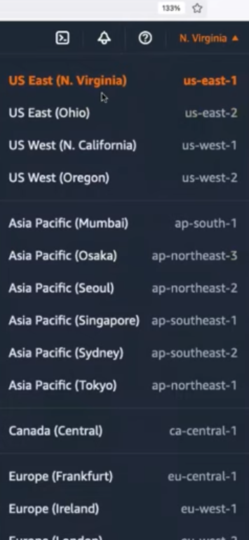
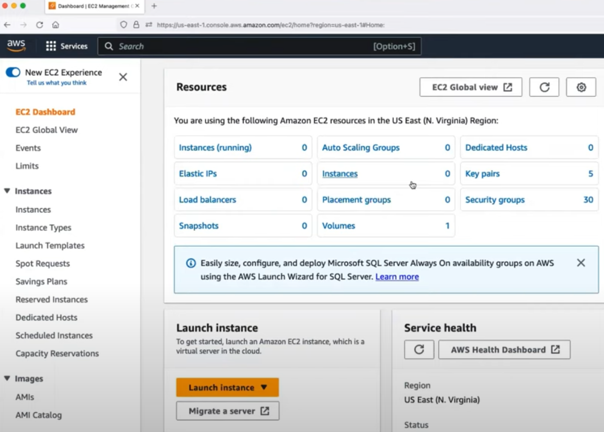
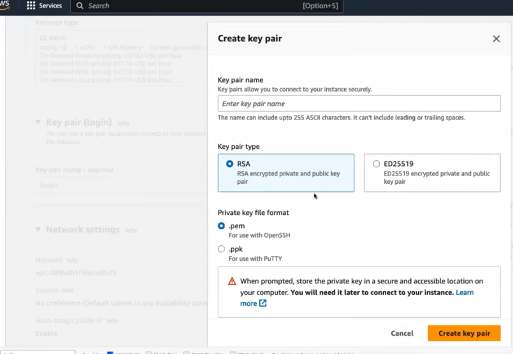
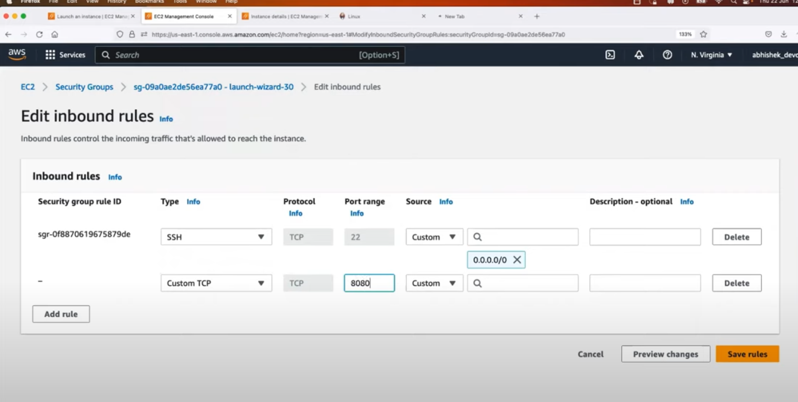

# What will you learn 

---
## Introduction to EC2:

**What is EC2, and why is it important?**

**Amazon Elastic Compute Cloud (Amazon EC2) is a web service that provides secure, resizable compute capacity in the cloud.**

**An EC2 instance (Elastic Compute Cloud) is a virtual server in Amazon Web Services (AWS) that provides scalable computing capacity in the cloud.** You can run various applications on EC2 instances, choosing the instance type (CPU, memory, storage, etc.) that fits your needs. **EC2 allows you to scale up or down based on demand, paying only for the resources you use.**

Access reliable, scalable infrastructure on demand. Scale capacity within minutes with SLA commitment of 99.99% availability.

Provide secure compute for your applications. Security is built into the foundation of Amazon EC2 with the AWS Nitro System.

Optimize performance and cost with flexible options like AWS Graviton-based instances, Amazon EC2 Spot instances, and AWS Savings Plans.


---
## EC2 use cases

Deliver secure, reliable, high-performance, and cost-effective compute infrastructure to meet demanding business needs.
Access the on-demand infrastructure and capacity you need to run HPC applications faster and cost-effectively.
**Access environments in minutes, dynamically scale capacity as needed, and benefit from AWS’s "pay-as-you-go" pricing.**
Deliver the broadest choice of compute, networking (up to 400 Gbps), and storage services purpose-built to optimize price performance for ML projects


---
## EC2 Instance Types

Follow [AWS instance types](https://docs.aws.amazon.com/AWSEC2/latest/UserGuide/instance-types.html) page for very detailed and updated information.

**1. General purpose:**

**General Purpose instances are designed to deliver a balance of compute, memory, and network resources.** They are suitable for a wide range of applications, including web servers, small databases, development and test environments, and more.

**2. Compute optimized:**

**Compute Optimized instances provide a higher ratio of compute power to memory. They excel in workloads that require high-performance processing such as batch processing**, scientific modeling, gaming servers, and high-performance web servers.


**3. Memory optimized:**

**Memory Optimized instances are designed to handle memory-intensive workloads. They are suitable for applications that require large amounts of memory, such as in-memory databases, real-time big data analytics**, and high-performance computing.

**4. Storage optimized:**

**Storage Optimized instances are optimized for applications that require high, sequential read and write access to large datasets. They are ideal for tasks like data warehousing, log processing,** and distributed file systems.

**5. Accelerated computing:**

**Accelerated Computing Instances typically come with one or more types of accelerators, such as Graphics Processing Units (GPUs)**,
Field Programmable Gate Arrays (FPGAs), or custom Application Specific Integrated Circuits (ASICs). 
These accelerators offload computationally intensive tasks from the main CPU, enabling faster and more efficient processing for specific workloads.


---


---
**Instance families**

```
    C – Compute
    D – Dense storage
    F – FPGA
    G – GPU
    Hpc – High performance computing
    I – I/O
    Inf – AWS Inferentia
    M – Most scenarios
    P – GPU
    R – Random access memory
    T – Turbo
    Trn – AWS Tranium
    U – Ultra-high memory
    VT – Video transcoding
    X – Extra-large memory
```

**Additional capabilities**

```
    a – AMD processors
    g – AWS Graviton processors
    i – Intel processors
    d – Instance store volumes
    n – Network and EBS optimized
    e – Extra storage or memory
    z – High performance
```


---
## EC2 Instance Basics:

Understanding the concept of virtual servers and instances.
**Key components of an EC2 instance: AMI (Amazon Machine Image), instance types, and instance states. Differentiating between On-Demand, Reserved, and Spot instances.**


---
## Launching an EC2 Instance:

- Step-by-step guide on launching an EC2 instance using the AWS Management Console.
- Configuring instance details, such as instance type, network settings, and storage options.
- Understanding security groups and key pairs for securing instances.


---
## Managing EC2 Instances:

- Starting, stopping, and terminating instances.
- Monitoring instance performance and utilization.
- Basic troubleshooting and accessing instances using SSH (Secure Shell).


---
# Regions and Availability Zones:

In the context of EC2 instances, a **region is a geographical location where AWS has data centers. Each region consists of multiple availability zones (AZs), which are isolated locations within that region**. Regions allow you to deploy EC2 instances closer to your users for lower latency, improved performance, and data compliance. You select a region when launching EC2 instances, and **resources within different regions are isolated from one another for redundancy and disaster recovery.**

Here are examples of AWS **regions** and their corresponding **availability zones**:

1. **Region: US East (N. Virginia)** – Region Code: `us-east-1`
   - Availability Zones:
     - `us-east-1a`
     - `us-east-1b`
     - `us-east-1c`
     - `us-east-1d`
     - `us-east-1e`
     - `us-east-1f`

2. **Region: EU (Frankfurt)** – Region Code: `eu-central-1`
   - Availability Zones:
     - `eu-central-1a`
     - `eu-central-1b`
     - `eu-central-1c`

3. **Region: Asia Pacific (Tokyo)** – Region Code: `ap-northeast-1`
   - Availability Zones:
     - `ap-northeast-1a`
     - `ap-northeast-1b`
     - `ap-northeast-1c`

Each **region** is a separate geographical area, and the **availability zones (AZs) within a region are isolated data centers, designed for redundancy and fault tolerance**. When you launch EC2 instances, you can choose which AZ to place them in for better resilience and availability.


---
**Regions:**


**EC2 Service Dashboard:**


**EC2 instance creation:**


**Key Pair for "secured connection" to EC2 instances:**


**Create inbound rule to enable Public access for web application running inside EC2 instance:**

