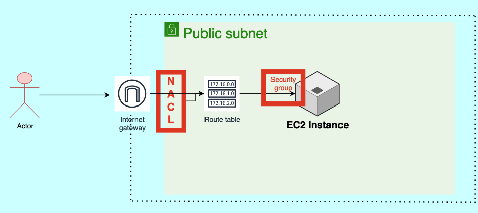

# AWS Security using Security Groups and NACL (Network Access Control Lists)

AWS (Amazon Web Services) provides multiple layers of security to protect resources and data within its cloud infrastructure. Two important components for network security in AWS are Security Groups and Network Access Control Lists (NACLs). 
AWS security for VPC networks can be managed using **Security Groups** and **Network ACLs (NACLs)**, which **provide different levels of control over traffic.**

---
## Security Groups (SGs):

Security Groups **act as virtual firewalls for Amazon EC2 instances (virtual servers) at the "instance" level. They control inbound and outbound traffic by allowing or denying specific protocols, ports, and IP addresses.**

**Each EC2 instance can be associated with one or more security groups, and each security group consists of inbound and outbound rules.**

**Inbound rules** determine the traffic that is allowed to reach the EC2 instance, whereas **outbound rules** control the traffic leaving the instance.

Security Groups can be configured using IP addresses, CIDR blocks, security group IDs, or DNS names to specify the source or destination of the traffic.

**They operate at the instance level and evaluate the rules before allowing traffic to reach the instance.**

**Security Groups are "stateful", meaning that if an inbound rule allows traffic, the corresponding outbound traffic is automatically allowed, and "vice versa".**

*Changes made to security group rules take effect "immediately".*

**Highlights:**

- **Instance-Level Security**: Security groups act as virtual firewalls at the instance level (e.g., EC2 instances).
- **Stateful**: If you allow inbound traffic, the response is automatically allowed (no need for an explicit outbound rule).
- **Rules**: Define inbound and outbound rules based on IP addresses, port numbers, and protocols (e.g., TCP, UDP).
- **Control**: Primarily used to permit traffic (i.e., you define "allow" rules).
- **Granularity**: Security groups are attached to individual EC2 instances.

Examples: 
- Allow SSH (port 22) access from a specific IP range.
- Allow HTTP (port 80) traffic from anywhere.

---
## Network Access Control Lists (NACLs)

**NACLs are an additional layer of security that operates at the "subnet" level.** They **act as stateless traffic filters for inbound and outbound traffic at the subnet boundary.**

Unlike Security Groups, NACLs are associated with subnets, and **each subnet can have only one NACL**. However, **multiple subnets can share the same NACL.**

**NACLs consist of a numbered list of rules (numbered in ascending order) that are evaluated in order from lowest to highest.**

Each rule in the NACL includes a rule number, protocol, rule action (allow or deny), source or destination IP address range, port range, and ICMP (Internet Control Message Protocol) type.

NACL rules can be configured to allow or deny specific types of traffic based on the defined criteria.

**They are "stateless", which means that if an inbound rule allows traffic, the corresponding outbound traffic must be explicitly allowed using a separate outbound rule.**

*Changes made to NACL rules may take "some time" to propagate to all the resources using the associated subnet.*

**Highlights:**

- **Subnet-Level Security**: NACLs control traffic at the subnet level, impacting all resources within the subnet.
- **Stateless**: Both inbound and outbound rules must be explicitly defined. Inbound rules do not automatically allow outbound traffic, and vice versa.
- **Rules**: You can define both "allow" and "deny" rules, giving more control over traffic flow.
- **Granularity**: Applied to entire subnets rather than individual instances.

Examples:
- Allow all inbound traffic on port 80 (HTTP).
- Deny all outbound traffic except for specific IP ranges.

---
## Key difference between SGs and NACLs

- **Security Groups** are **stateful** and applied to **instances**.
- **NACLs** are **stateless** and applied to **subnets**, allowing both "allow" and "deny" rules.

Together, **Security Groups** and **NACLs** provide layered security in AWS, offering fine-grained control over network access.

---
## Project sample

---
**1. VPC Dashboard:**

**2. Create VPC and more (subnets):**

**3. Create an EC2 instance and assign a custom VPC:**

**4. ACLs network rules of VPC in order from lowest to max (star `*` is the last rule):**

*The lowest rule is evaluated 1st, i.e. if a lower rule number has an action that is opposite to a higher number then that is the priority (like a `break` clause), e.g. if rule #100 denies inbound TCP traffic to a specific Port (8888) then if rule #300 allows "all" incoming traffic from every Port Number then because of the lowest priority rule the final result will be allowing all incoming traffic except the one that comes from Port number 8888 (which will be evaluated 1st).*
        