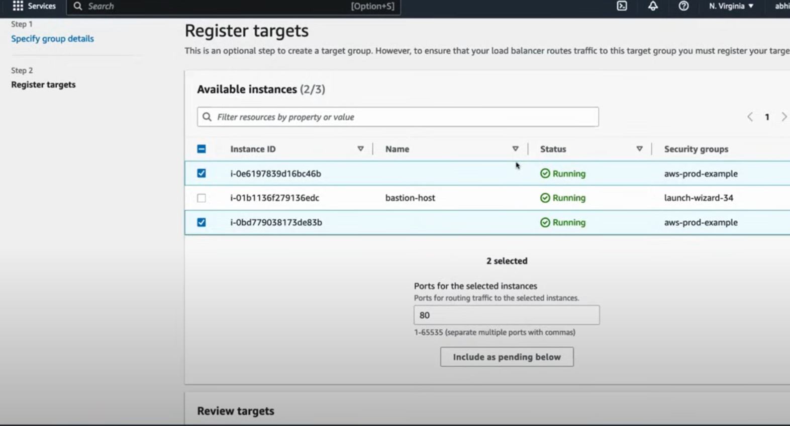

# DEMO

[AWS VPC example of private subnets NAT](https://docs.aws.amazon.com/vpc/latest/userguide/vpc-example-private-subnets-nat.html)

---
In the context of AWS, a **Bastion host** (also known as a jump box) is a server that **acts as a secure bridge to access private network instances (like EC2 instances) that do not have direct internet access**. It is a critical component **for securely managing and troubleshooting infrastructure** that is hosted in private subnets within Amazon Virtual Private Cloud (VPC).

**Key Features of a Bastion Host in AWS:**

1. **Controlled Access**: Bastion hosts are placed in a public subnet with internet access, allowing administrators to connect to them via SSH or RDP. From there, they can access resources in private subnets.
2. **Security**: It acts as a security layer, limiting direct exposure of private instances to the internet. Access is tightly controlled with security groups and can be restricted using IP whitelisting.
3. **Auditing**: By funneling access through the Bastion host, it's easier to log, monitor, and audit administrative actions performed on private instances.
4. **Tunneling**: SSH tunneling through the Bastion host can securely route traffic to instances in private subnets without exposing them directly to the internet.

**Common Use Cases:**

- **Administrative Access**: When instances in private subnets need management but should not be exposed to the internet, administrators can securely connect to them through a Bastion host.
- **Accessing Databases or Application Servers**: In situations where sensitive applications or databases are hosted in private subnets, a Bastion host is used to access these resources without exposing them to public networks.

AWS offers services like **AWS Systems Manager Session Manager**, which provides secure access to instances without needing a Bastion host, further improving security and reducing operational overhead.

The use of Bastion hosts is a well-established pattern for improving security in cloud environments.

---
**Launch Template - Auto Scaling Groups**

**Assign VPC to launch template:**

**Attach Load Balancer to launch template** (For the example following the diagram this isn't here, instead later on, the Target Groups are assigned to the Application Load Balancer):

**Create Application Load Balancer of EC2 instances:**

**Assign Security Groups to Application Load Balancer (ALB):**

**Create Target Group for Assigning EC2 instances to Application Load Balancer (ALB):**

**Register Targets of EC2 instances of the Target Group:**

---
[DEMO Video](https://youtu.be/FZPTL_kNvXc)