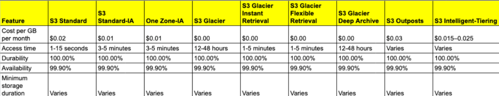

# AWS S3

---
## What is Amazon S3?

**Amazon S3 (Simple Storage Service) is a cloud storage service that allows you to store and retrieve any amount of data at any time.** It **organizes data into "buckets," where you can upload files (called "objects"), which are accessible via unique keys.** It offers high availability, scalability, and security, making it **ideal for backups, data archives, or serving static content.**

**What are S3 buckets?**

**S3 buckets are containers for storing objects (files) in Amazon S3. Each bucket has a unique name globally across all of AWS.** You can think of an S3 bucket as a top-level folder that holds your data.

**Why use S3 buckets?**

S3 buckets provide a reliable and highly scalable storage solution for various use cases. They are **commonly used for backup and restore, data archiving,** content storage for websites, and as a data source for big data analytics.

**Key benefits** of S3 buckets:

- **Durability and availability:** S3 provides high durability and availability for your data.
- **Scalability:** You can store and retrieve any amount of data without worrying about capacity constraints.
- **Security:** S3 offers multiple security features such as encryption, access control, and audit logging.
- **Performance:** S3 is designed to deliver high performance for data retrieval and storage operations.
- **Cost-effective: S3 offers cost-effective storage options** and pricing models based on your usage patterns.

**Amazon S3 buckets are "globally accessible" but are associated with a specific AWS region for performance**, data locality, and regulatory reasons. Here's how that works:

1. **Region-based Storage: When you create an S3 bucket, you choose a specific AWS region (e.g., US-East-1 or EU-West-1). This determines where the data physically resides, which can optimize latency, reduce costs, and meet compliance or legal requirements.** The data is stored in that region, often replicated across multiple availability zones for redundancy.

2. **Global Access: Despite being stored in a specific region, S3 provides a globally accessible URL.** This means that you (or anyone with the proper permissions) can access the bucket and its objects from anywhere in the world over the internet. AWS's global network infrastructure helps ensure that even if data is stored in one region, it can be accessed quickly from other regions or locations.

3. **Performance and Compliance**: Region-based storage allows you to choose a location that is geographically close to your users for faster access, or in a specific region for compliance with data residency laws. However, **since S3 is globally accessible, users across the world can still interact with the data if permissions allow.**

***In summary, S3 buckets are tied to a region to control where the data is stored, but global access ensures that the data can be reached from anywhere as needed.***

---
## Creating and Configuring S3 Buckets

**1. Creating an S3 bucket:**

**To create an S3 bucket, you can use the AWS Management Console, AWS CLI (Command Line Interface), or AWS SDKs (Software Development Kits).** You need to **specify a "globally" unique bucket name and select the region where you want to create the bucket.**

**2. Choosing a bucket name and region:**

**The bucket name must be unique across all existing bucket names in Amazon S3.** It should follow DNS naming conventions, be 3-63 characters long, and contain only lowercase letters, numbers, periods, and hyphens. 
**The region selection affects data latency and compliance with specific regulations.**

**3. Bucket properties and configurations:**

**Versioning:** Versioning allows you to keep multiple versions of an object in the bucket. It helps protect against accidental deletions or overwrites.

**4. Bucket-level permissions and policies:**

**Bucket-level permissions and policies define who can access and perform actions on the bucket. You can grant permissions using IAM (Identity and Access Management) policies,** which allow fine-grained control over user access to the bucket and its objects.

---
## Uploading and Managing Objects in S3 Buckets

**1. Uploading objects to S3 buckets:**

You can upload objects to an S3 bucket using various methods, including the AWS Management Console, AWS CLI, SDKs, and direct HTTP uploads. **Each object is assigned a unique key (name) within the bucket to retrieve it later.**

**2. Object metadata and properties:**

**Object metadata contains additional information about each object in an S3 bucket. It includes attributes like content type, cache control, encryption settings, and custom metadata.** These properties help in managing and organizing objects within the bucket.

**3. File formats and object encryption:**

**S3 supports various file formats, including text files, images, videos, and more. You can encrypt objects stored in S3 using server-side encryption (SSE).** SSE options include SSE-S3 (Amazon-managed keys), SSE-KMS (AWS Key Management Service), and SSE-C (customer-provided keys).

**4. Lifecycle management:**

**Lifecycle management allows you to define rules for transitioning objects between different "storage classes" or deleting them automatically based on predefined criteria.** For example, you can **move infrequently accessed data to a lower-cost storage class after a specified time** or delete objects after a certain retention period.

**5. Multipart uploads:**

**Multipart uploads provide a mechanism for uploading large objects in parts, which improves performance and resiliency.** You can upload each part in parallel and then combine them to create the complete object. **Multipart uploads also enable resumable uploads in case of failures.**

**6. Managing large datasets with S3 Batch Operations:**

**S3 Batch Operations is a feature that allows you to perform bulk operations on large numbers of objects in an S3 bucket.** It provides an **efficient way to automate tasks such as copying objects, tagging, and restoring archived data.**

---
## Advanced S3 Bucket Features

**- S3 Storage Classes:**

S3 offers multiple storage classes, **each designed for different use cases and performance requirements:**

**- S3 Replication:**

**S3 replication enables automatic and asynchronous replication of objects between S3 buckets in different regions or within the same region.** Cross-Region Replication (CRR) provides disaster recovery and compliance benefits, while Same-Region Replication (SRR) can be used for data resilience and low-latency access.

**- S3 Event Notifications and Triggers:**

**S3 event notifications allow you to configure actions when specific events occur in an S3 bucket.** For **example, you can trigger AWS Lambda functions**, send messages to Amazon Simple Queue Service (SQS), or **invoke other services using Amazon SNS when an object is created or deleted.**

**- S3 Batch Operations:**

**S3 Batch Operations allow you to perform large-scale batch operations on objects, such as copying, tagging, or deleting, across multiple buckets.** It simplifies managing large datasets and automates tasks that would otherwise be time-consuming.

---
## Security and Compliance in S3 Buckets

**- S3 bucket security considerations:**

Ensure that S3 bucket policies, access control, and encryption settings are appropriately configured. **Regularly monitor and audit access logs for unauthorized activities.**

**- Data encryption at rest and in transit:**

**Encrypt data at rest using server-side encryption options provided by S3. Additionally, enable encryption in transit by using SSL/TLS for data transfers.**

In the phrase "data encryption at rest and in transit," **"at rest"** refers to data that is stored in a persistent state, such as on disk drives, databases, or backups. Encryption at rest protects this data from unauthorized access when it is not being actively used or transferred. 

On the other hand, **"in transit"** refers to data that is actively moving between systems, such as across the internet or within a network. Encryption in transit ensures that the data remains secure while being transmitted.

**- Access logging and monitoring:**

**Enable access logging to capture detailed records of requests made to your S3 bucket.** Monitor access logs and configure alerts to detect any suspicious activities or unauthorized access attempts.

---
## S3 Bucket Management and Administration

**- S3 bucket policies:**

**Create and manage bucket policies to control access to your S3 buckets. Bucket policies are written in "JSON" and define permissions for various actions and resources.**

**- S3 access control and IAM roles:**

**Use IAM roles and policies to manage access to S3 buckets.** IAM roles provide temporary credentials and fine-grained access control to AWS resources.

**- S3 APIs and SDKs:**

**Interact with S3 programmatically using AWS SDKs or APIs.** These provide libraries and methods for performing various operations on S3 buckets and objects.

**- Monitoring and logging with CloudWatch:**

**Utilize Amazon "CloudWatch" to monitor S3 metrics, set up alarms for specific events, and collect and analyze logs for troubleshooting and performance optimization.**

**- S3 management tools:**

AWS provides multiple management tools, such as the AWS Management Console, AWS CLI, and third-party tools, to manage S3 buckets efficiently and perform operations like uploads, downloads, and bucket configurations.

---
## Troubleshooting and Error Handling

**- Common S3 error messages and their resolutions:**

**Understand common S3 error messages like access denied, bucket not found, and exceeded bucket quota.** Troubleshoot and resolve these errors by checking permissions, bucket configurations, and network connectivity.

**- Debugging S3 bucket access issues:**

**Investigate and resolve issues related to access permissions, IAM roles, and bucket policies. Use tools like AWS CloudTrail and S3 access logs** to identify and troubleshoot access problems.

**- Data consistency and durability considerations:**

Ensure data consistency and durability by understanding S3's data replication and storage mechanisms. Verify that data is correctly uploaded, retrieve objects using proper methods, and address any data integrity issues.

**- Recovering deleted objects:**

**If an object is accidentally deleted, you can often recover it using versioning or S3 event notifications. Additionally, consider enabling Cross-Region Replication (CRR) for disaster recovery scenarios.**

---
**S3 allows any kind of storage**

[s3_allows_any_kind_of_storage](./img/1_s3_bucket_allows_any_kind_of_storage.png)

**Access S3 bucket from anywhere (Global Region access)**

[access_s3_bucket_from_anywhere](./img/2_access_s3_bucket_global_access_storage.png)

**S3 Bucket dashboard has Global region**

[s3_bucket_dashboard_has_global_region](./img/3_s3_bucket_dashboard_has_global_region.png)

**Create S3 Bucket has Global access**

[create_s3_bucket_has_global_access](./img/4_create_s3_bucket_has_global_access.png)

**Upload data into S3 Bucket**

[upload_data_into_s3_bucket](./img/5_upload_data_into_s3_bucket.png)

**Upload Storage Actions**

[upload_storage_actions](./img/6_uploaded_storage_actions.png)

**Enable versioning in S3 Bucket**

[enable_versioning_in_s3_bucket](./img/7_enable_bucket_versioning.png)

**Edit bucket permissions**

[edit_bucket_permissions](./img/8_edit_bucket_permissions.png)

**Static Web Hosting**

[static_web_hosting](./img/9_static_web_hosting.png)
